# 抽出された文章

INGUIDE Level 1: Module 01

# CONTENTS

MEET

YOUR

INSTRUCTOR.......................

Instructor: Dr. Holger Schünemann ...............................................................

Disclosures ................................................ .

PART 1: LEARNING OBJECTIVES & OVERVIEW .......................... .

Course Objectives.......................................................... .. .

Practice Guidelines..................................................................................................................8

What is a Recommendation?....... . . . . . . . . . . .

Anatomy of a Guideline............................................................. ...... 10

Six Principles of Trustworthy and High - Quality Guidelines ....................................... .. .. ..11 Supporting Information ................................................................ . .13 Organizations Typically Involved in Developing Guidelines ............. .

The GIN - McMaster Checklist for Guideline Development ........................................... .	.15

Guideline Checklist Competencies —16

You Have Completed Part 1...................................................................................................18

PART 2: THE GUIDELINE PROCESS....................................................... 19

People Involved in the Guideline Process — the Guideline Panel......................20 Other People Involved in the Guideline Process — Beyond the Panel ............................... . . .21

First Steps in Guideline Development .............................................. ...	.......23

Guideline Group Membership — Selection and Persons Involved..............25

Guideline Group Membership — the Panel Member...............................................................27

Establishing the Group Process................................................ .	. . . . .......29 Distinguishing Opinion From Evidence in Guidelines — Part 1.................................................33

Distinguishing Opinion From Evidence in Guidelines — Part 2......................... ... .34 Identifying the Target Audience & Understanding the Topic......... . . ...................................35. You Have Completed Part 2...........................................................................37

PART 3: CONSUMER & STAKEHOLDER INVOLVEMENT AND CONFLICT OF INTEREST

CONSIDERATIONS ... .......................38

Consumer & Stakeholder Involvement ..................................................... . .......39 Conflict of Interest— Definition........................................ .40

Conflict of Interest — Declaration and Management....................................

Conflict of Interest - GIN Principles— Part 1 .................................

.42

Conflict of Interest - GIN Principles — Part 2 — 43

Conflict of Interest - GIN Principles— Part 3 ...................................... 	• •

Conflict of Interest - GIN Principles — Part 4 .................................................45

Conflict of Interest - GIN Principles— Part 5 ..................................... .....46

Conflict of Interest - GIN Principles — Part 6 ...........................................................47

Conflict of Interest - GIN Principles — Part 7 .......48 Conflict of Interest - GIN Principles — Part 8 ....................................

Conflict of Interest - GIN Principles — Part 950

You Have Completed Part 3........................51

MEET

YOUR

INSTRUCTOR

# INSTRUCTOR: DR. HOLGER SCHÜNEMANN

## Module 1 Instructor

Dr. Holger Schünemann

Image: Dr. Holger Schünemann headshot

Hello, I am Holger Schünemann, your instructorfor the first course in the Guideline Credentialing and Certification program.

This program was developed through the contributions of the Guidelines International Network — also known as GIN - and the McMaster University GRADE Centre — also known as McGRADE.

In this course we will focus on the role of a Guideline Development Group or Guideline Panel

Member.

DISCLOSURES

•

Cochrane

Canada

-

Director

- GRADE Working Group Co-Chair
- Guideline International Network - Board Member
As a disclosure, I am involved in various roles with groups which will be mentioned repeatedly throughout the course.

These groups include Cochrane, the GRADE working group, and the Guidelines International Network.

PART 1: LEARNING OBJECTIVES & OVERVIEW

International

Guideline

Development

## COURSE OBJECTIVES

Course Objectives

Be prepared to participate meaningfully in the creation of health guidelines through the perspective Of a guideline panel or guideline development group member

Be able to apply specific steps in the guideline development process as relevant for guideline panel members

Know the GIN-McMaster approach to guideline development

- Be prepared to participate meaningfully in the creation of health guidelines through the perspective of a guideline panel or guideline development group member
- Be able to apply specific steps in the guideline development process as relevant for guideline panel members
Know the GIN-McMaster approach to guideline development

At the end of this course learners will be prepared to participate meaningfully in the creation of health guidelines through the perspective of a guideline panel or guideline development group member, terms we will use interchangeably.

In addition, learners will be able to apply specific steps in the guideline development process as relevant for guideline panel members.

Learners will also gain an understanding of the methods outlined in the GIN-McMaster approach to guideline development.

# PRACTICE GUIDELINES

## Practice Guidelines

- Systematically developed evidence-based statements which allow providers, recipients and other stakeholders to make informed decisions about appropriate health interventions
- Health interventions include clinical procedures, public health actions, and policies (WHO, IOM)
- Statements that include recommendations intended to optimize patient health or healthcare
- Informed by a systematic review of evidence and an assessment Of the desirable and undesirable consequences of alternative options
- Systematically developed evidence-based statements which allow providers, recipients and other stakeholders to make informed decisions about appropriate health interventions
- Health interventions include clinical procedures, public health actions, and policies (WHO, IOM)
- Statements that include recommendations intended to optimize health or healthcare
- Informed by a systematic review of evidence and an assessment of the benefits and harms of alternative options
Reference: Ann Intern Medicine. https:doi.org/10.7326/M18-3445

What is a guideline? Guidelines are systematically developed, evidence-based statements which allow providers, recipients, and other stakeholders to make informed decisions about appropriate health interventions. Health interventions are defined broadly to include clinical procedures, public health actions, and policies.

Health guidelines are statements that include recommendations intended to optimize health or healthcare that are informed by a systematic review of evidence and an assessment of the desirable and undesirable consequences of alternative options.

WHAT IS A RECOMMENDATION?

- A recommendation is a specific and actionable statement
Guidelines contain one or many recommendations

The image on the right shows an example of a recommendation among many in a guideline

- Factors for the number of recommendations are determined by time, available resources, and the number of priorities
Reference: https://www.dropbox.com/s/9ucbc6fagihOx2f/Schunemann%20-

What is a recommendation? A recommendation is a specific and actionable statement. Statements that are too vague to be implemented, and that might lead to inefficient or counterproductive behavior, should be avoided. Guidelines contain one or more than one recommendation. Here you see an example of a recommendation that is one of many in a guideline. The number of recommendations in a guideline will be determined by many factors including the topic and priorities and the time and resources available to name a few.

## ANATOMY OF A GUIDELINE

### Anatomy of a Guideline

Guidelines may be published as scientific journal articles or on the website of an organization

They typically include an executive summary with the key recommendations and the brief rationale for those recommendations

- Guidelines may be published as scientific journal articles or on the website of an organization
- They typically include an executive summary with the key recommendations and the brief rationale for those recommendations
Guidelines may be published as scientificjournal articles, on the websites of an organization or through other means, such as apps.

They typically include an executive summary with the key recommendations and the brief rationale for those recommendations.

Six Principles of Trustworthy and High - Quality Guidelines

Based on best available evidence using systematic review methodology

Developed

knowledgeable,

multidisciplinary

experts

&

from

a

diversity

affected

Reconsider

appropriate

new

evidence

modificatons

recommendations

Clear explanation of the relationship between alternative options and health outcomes, and provide ratings Of the certainty Of evidence and strength of recommendations

## SIX PRINCIPLES OF TRUSTWORTHY AND HIGH - QUALITY GUIDELINES

LOGO images displayed:

World Health Organization

The National Academy of Sciences in the United States

Guidelines International Network

Agree Consortium

RIGHT Working Group

- Based on best available evidence using systematic review methodology
- Developed by a knowledgeable, multidisciplinary panel of experts & representatives from a diversity of key affected groups
- Focus on values and preferences of people affected by the guidelines
- Clear explanation of the relationship between alternative options and health outcomes, and provide ratings of the certainty of evidence and strength of recommendations
- Reconsider and revise as appropriate when important new evidence warrant modifications of recommendations
- Explicit and transparent process that minimizes distortions, biases, and conflicts of interest
The work of many professional groups agrees on several core principles for trustworthy guidelines.

These groups include the World Health Organization, the National Academy ofSciences in the United States, the Guidelines International Network, the AGREE consortium, and the RIGHT Working Group.

There are at least six principles that guidelines should fulfill to make them both trustworthy and of high quality.

- They should be based on the best available evidence, using systematic review methodology.
- They should be developed by a knowledgeable, multidisciplinary panel of experts and representatives from a diversity of key affected groups.
- They shouldfocus on what matters to people who will be affected by the guidelines. In the context of health guidelines, this means taking into account values and preferences.
- They should provide a clear explanation of the relationships between alternative options and health outcomes, and provide ratings of both the certainty of evidence and the strength of recommendations.
- They should be reconsidered and revised as appropriate when important new evidence warrants modifications of recommendations.
And 6. finally, they should be based on an explicit and transparent process to minimize distortions, biases, and conflicts of interest.

## SUPPORTING INFORMATION

### Supporting Information

- A recommendation is supported by:
- explanatory remarks,
- background information,
- subgroup considerations,
- A recommendation is supported by: o explanatory remarks, background information, o subgroup considerations, o justifications, and 	possibly linked to other recommendations
- For full transparency all the criteria that influenced a recommendation and that the guideline panel considered may be included
- Guideline panel members contribute to the considerations that influenced the recommendation
Ideally a recommendation is supported by explanatory remarks, background information, subgroup considerations, justifications, and possibly linked to other recommendations. Forfull transparency all the criteria that influenced a recommendation and that the guideline panel considered may be included. It is the guideline panel members task to contribute to the considerations that influenced the recommendation.

## ORGANIZATIONS TYPICALLY INVOLVED IN DEVELOPING GUIDELINES

Governmental health departments

Professional organizations

Non-governmental health organizations

Organizations Typically Involved in Developing Guidelines

- These organizations typically take an oversight role and appoint groups
- Individuals that can be involved in guideline development can come from different backgrounds
sue.

- Governmental health departments
- Professional organizations
- Non-governmental health organizations
These organizations typically take an oversight role and appoint groups

Individuals that can be involved in guideline development can come from different backgrounds

The initiative to develop a guideline con come from any organization, but typically involves governmental health departments (for example a Ministry of Health), professional organizations representing a specific health sector (for example the American Society of Hematology), or nongovernmental health organizations (for example the World Health Organization).

These organizations typically take an oversight role and appoint guideline development groups or panels.

Individuals involved in guideline development can come from different backgrounds, including clinicians, public health officers, allied health professionals, health policy makers, as well as patients or people with a condition and their representatives.

## THE GIN - MCMASTER CHECKLIST FOR GUIDELINE DEVELOPMENT

### Check out: GIN - McMaster Guideline Development Checklist

This course primarily uses the conceptual description to guideline development that is define d by the GIN-McMaster checklist and toolbox to guideline development. Here you see a schematic presentation of the GIN-McMaster checklist.

Each of these components and steps will be discussed in this course with an emphasis on those that are relevantfor guideline panel members.

GUIDELINE

CHECKLIST

COMPETENCIES

Guideline

Development

Credentialing

Instructor

Course

- Guideline Group or Panel Member Course
- Guideline Methodologist Course
- Master Guideline Developer and Chair Course
- Organization, Budget, Planning and Training
- Priority Setting
3. Guideline Group Membership

4. Establishing Guideline Group Processes

- Identifying Target Audience and Topic Selection
- Consumer and Stakeholder Involvement
- Conflict of Interest Considerations
- (PICO) Question Generation
- Considering Importance of Outcomes and Interventions, Values, Preferences and Utilities
10. Deciding what Evidence to Include and Searching for Evidence

- Summarizing Evidence and Considering Additional Information
- Judging Quality, Strength or Certainty of a Body of Evidence
- Developing Recommendations and Determining their Strength
- Recommendations and of Considerations of Implementation, Feasibility and Equity
- Reporting and Peer Review
- Dissemination and Implementation
- Evaluation and Use
- Updating
The GIN-McMaster approach is laid out step-by-step in the GIN-McMaster Guideline Development Checklist.

The Guideline Development Checklist project is a partnership between the Guidelines

International Network (GIN) and McMaster University, just like the INGUIDE program.

The checklist is intended for use by guideline developers to plan and track the process of guideline development and to help ensure that no steps are missed. It also provides important resources for the individual steps and topics.

As a guideline development group member, you will become familiar with many of the steps described in the checklist.

### YOU HAVE COMPLETED PART 1

You have completed Part 1!

Part 2 will describe the guideline process.

You have completed Part 1!

Part 2 will describe the guideline process.

PART

2:

THE

GUIDELINE

PROCESS

## PEOPLE INVOLVED IN THE GUIDELINE PROCESS — THE GUIDELINE PANEL

People Involved in the Guideline Process — The Guideline Panel

As a guideline panel member, you will be part Of the process that determines the recommendations

Guideline Group Membership & Processes:

- Consumers & Stakeholders
- Guideline Panel
- Working Groups
- Oversight Committee
As a guideline panel member, you will be part of the process that determines the recommendations

Here you can see the people involved in the guideline process, and as a guideline panel member you will be part of the process that determines the recommendations that we have talked about.

## OTHER PEOPLE INVOLVED IN THE GUIDELINE PROCESS — BEYOND THE PANEL

Other People Involved in the Guideline Process — Beyond the Panel

- Takes responsibility for the whole guideline process, which mav include a guideline coordinator and the committee may also be tasked With approving proposals for guideline development and for approving the completed guidelines
- E.g., the WHO has a Guideline Review Committee, Which ensures that their guidelines follow the
WHO Handbook for guideline development

- Takes responsibility for the whole guideline process, which may include a guideline coordinator and the committee may also be tasked with approving proposals for guideline development and for approving the completed guidelines
E.g., the WHO has a Guideline Review Committee, which ensures that their guidelines follow the WHO Handbook for guideline development

- A group of individuals with expertise in the area of interest who create the recommendations under the leadership of one or more chairs
- Provides external or internal input and may also be members of the guideline panel 	May be involved at the peer review stage or to provide their feedback at various stages of the guideline process
E.g., groups that conduct the literature review or serve as technical experts for a particular topic

Let's focus now on the groups and people involved in the process. As mentioned, this diagram describes the overall process. The key people involved can be divided into:

An oversight committee who typically may take responsibility for the whole guideline process, which may include a guideline coordinator (many professional societies that produce guidelines often have a coordinator to manage the process or a technical officer at WHO) and the committee may also be tasked with approving proposalsfor guideline development and ultimately approving the completed guidelines.

For example, the WHO or World Health Organization has a Guideline Review Committee, which ensures that guidelines produced by WHO follow the WHO Handbookfor guideline development.

The guideline panel is generally a group of individuals with expertise in the area of interest, including patient or public representatives, who create the recommendations under the leadership of one or more chairs.

The consumers and stakeholders may provide external or internal input and may also be members of the guideline panel. However, they may also only be involved at the peer review stage or to provide theirfeedback at various stages of the guideline process —for example when prioritizing questions or ranking outcomes.

Finally, there often are working groups, such as groups that conduct the literature review or serve as technical experts for a particular topic.

## FIRST STEPS IN GUIDELINE DEVELOPMENT

First Steps in Guideline Development

As a guideline panel member, you Will want main topic

•

Guideline

Organization,

•

priority

setting

for

the

to know that steps are • Budget, followed appropriately, • Planning, and • using criteria for although you are not	importance to key

• Training

responsible for many	stakeholders, including of them Guideline panel members are practitioners, patents, and typically not involved in this policy makers step, unless they are also part of an oversight committee

Module e.rt2

As a guideline panel member, you will want to know that steps are followed appropriately, although you are not responsible for many of them

Step 1

Step 2

•

Guideline organization,

Priority setting for the main topic

•

Budget,

Using criteria for importance to key

•

Planning, and

stakeholders, including

•

Training

practitioners, patients, and

Guideline panel members are typically not	policy makers involved in this step, unless they are also part of an oversight committee

As o guideline panel member, you will want to know that steps are followed appropriately, although you are not responsible for many of them.

The first step of the GIN-McMaster Checklist involves guideline organization, budget, planning and training. The organization developing the guideline will primarily decide this step, with input from experienced guideline developers.

As mentioned, guideline panel members are typically not involved in this step, unless they are also part of an oversight committee. They may however ask if this step has been taken with success. For instance, if there is funding for the project or a risk to run out offunds during the development of the guideline.

The second step involves priority setting for the main topic (for example, breast cancer screening or a rare condition for which a guideline is needed) using criteria for importance to key stakeholders, including practitioners, patients, and policy makers.

At this stage, guideline panel members have not yet started their work as panel member. You may participate in the consultation process to set the priority for the topic, but typically not yet in the role of a panel member.

## GUIDELINE GROUP MEMBERSHIP — SELECTION AND PERSONS INVOLVED

Guideline Group Membership — Selection and Persons Involved

Guideline group members are typically not part ot the selection process for group members

Have a balanced multidisciplinary representation, with representatives from all groups Of key Stakeholders

Main considerations that panel members should be aware of

Several other potential roles within a guideline panel

Invitation Of guideline group leaders and is typically done by the leading organization in collaboration with an oversight committee

Roles and expectations should be outlined at the start, and appropriate leaders need to be selected

The entire process ot selection and role descriptions should be documented to ensure transparency

- Guideline group members are typically not part of the selection process for group members
- Main considerations that panel members should be aware of
- Have a balanced multidisciplinary representation, with representatives from all groups of key stakeholders
- Several other potential roles within a guideline panel
- Invitation of guideline group leaders and members is typically done by the leading organization in collaboration with an oversight committee
- Roles and expectations should be outlined at the start, and appropriate leaders need to be selected
- The entire process of selection and role descriptions should be documented to ensure transparency
Guideline group members are typically not part of the selection process for group members, including the appointment of the chairs; that is typically done by the organization responsible for the guideline.

Still, there are some main considerations that panel members should be aware of, to understand what constitutes an appropriate panel.

It is critical that guideline groups or panels have a balanced multidisciplinary representation, with representatives from all groups of key stakeholders. This can include members from the audience the guideline is targeting, patients and their representatives, healthcare providers, content experts, methodology experts, health economists, and policy makers. Other relevant considerations can for example include a balance of gender, race and geographic representation. There are several other potential roles within a guideline panel, including technical experts, systematic review authors, observers, technical staff, among others.

Invitation of guideline group leaders and members is typically done by the leading organization in collaboration with an oversight committee, although other approaches are possible.

Roles and expectations should be outlined at the start, and appropriate leaders need to be selected.

The entire process of selection and role descriptions should be documented to ensure transparency, so guideline users can decide whether or not there are any concerns.

## GUIDELINE GROUP MEMBERSHIP —THE PANEL MEMBER Guideline Group Membership — The Panel Member

Responsibilities Of a panel member

Guideline Participant

Tool informs members Ot a guideline panel

Prioritization Of questions for the guideline

Partieipatfng in group meetingS

Additional roles may be assigned to panel members

Some groups ask experts to contribute evidence

providing input on evidence and contextual factors

Reviewing evidence summaries

Making judgments on the presented evidence and

ReViewingand Mitin8 final guideline reports

Supporting the guideline dissemination

- Guideline Participant Tool informs members of a guideline panel
- Additional roles may be assigned to panel members
- Some groups ask experts to contribute evidence
Responsibilities of a panel member

- Prioritization of questions for the guideline
- Participating in group meetings
- Providing input on evidence and contextual factors
- Reviewing evidence summaries
- Making judgments on the presented evidence and formulating recommendations
- Reviewing and writing final guideline reports
- Supporting the guideline dissemination
On a guideline panel, all full members have an equal voice. Typically, a panel member will be responsible for the following:

- The prioritization of questions for the guideline
- Participating in group meetings, which can be in-person, by web conference or teleconference
- Providing input on evidence and contextual factors
- Reviewing evidence summaries
- Making judgments on the presented evidence and formulating recommendations
- Reviewing and writing of the final guideline reports
- And finally, supporting the dissemination of the guideline
Many guideline developers use tools such as the Guideline Participant Tool to inform members of a guideline panel.

Additional roles may be assigned to panel members. For example, patients and their representatives may be asked to provide specific information from the patient's or person's perspective, and research methodologists may be invited to critically review the quality of the evidence in-depth.

Some groups ask experts to contribute evidence, in particular when evidence is sparse or even help in the evidence synthesis process.

## ESTABLISHING THE GROUP PROCESS

## Establishing The Group Process

Panel Members	Commumcation Rules

- Understand your tasks, obligations, and rights before the development process starts
- Multidisciplinary panel aiming to establish equal opportunity for input from distinct voices
- Rules for frequency and mode Of communication, training and support, opportunities for discussion and feedback, and sharing of documents to be established upfront
- Meeting minutes to be recorded, and accessible at all times
Voting panel members need to be aware of:

- How to interact With the chairs and other panel members
- Judgments they are expected to make
- Rules are for reachine consensus
- process for conflicts Ordisputes
Panel Members

- Understand your tasks, obligations, and rights before the development process starts
- Multidisciplinary panel aiming to establish equal opportunity for input from distinct voices
Communication Rules

- Rules for frequency and mode of communication, training and support, opportunities for discussion and feedback, and sharing of documents to be established upfront
- Meeting minutes to be recorded, and accessible at all times
Voting

- Voting panel members need to be aware of:
- How to interact with the chairs and other panel members, o Judgments they are expected to make, o Rules for reaching consensus, o Process for conflicts or disputes
As o panel member, you should understand your tasks, obligations, and rights before the development process starts. Overall, the aim of a multidisciplinary panel should be to establish equal opportunity for inputfrom distinct voices.

Rules for frequency and mode of communication, training and support, opportunities for discussion and feedback, and sharing of documents will be established upfront. Meeting minutes need to be recorded and accessible at all times, either internally only or both internally and publicly.

Voting panel members also need to be aware of how they are expected to interact with the chairs and other panel members, which judgments they are expected to make, what the rules are for reaching consensus, and what the process is to deal with conflicts or disputes (for example the use of anonymous voting, or a quorum for formulating a recommendation).

# ESTABLISHING GUIDELINE GROUP PROCESSES — COMMITMENTS

## Establishing Guideline Group Processes - Commitments

•

Here

is

an

illustrative

example

for

how

this

can

take

place

by

providing

concepts

from

the

Guideline

•

Different

organizational

approaches

inform

and

train

panel

members

- Different organizational approaches inform and train panel members
- Here is an illustrative example for how this can take place by providing concepts from the Guideline Participant Tool
- You should seek information about what is expected of you when you get engaged in a guideline development effort
Table source: Link (https://heigrade.mcmaster.ca/guideline-development/guidelineparticipants)

Organizations use different approaches to inform and train their panel members. We will use an illustrative example for how this can take place by providing concepts from the Guideline Participant Tool, but alternative methods are commonly used. The important aspect is that you should seek information about what is expected of you when you get engaged in a guideline development effort.

Conceptually, it is helpful to separate the steps that participants should consider or take in the preparation phase, during guideline group meetings, and following meetings. The rest of this course will provide detailed information about the roles and responsibilities of those who participate in guideline development groups or panels.

WHAT IS AN EXPERT?

What is an Expert?

- A person who is very knowledgeable about or skillful in a particular area
- Experts are often needed to interpret evidence, but expert opinion and evidence are not the same
- Includes patients and patient representatives with expertise and insight through experiencing a condition
It is important to define experts, and particularly so with patient members on a panel. We define experts very broadly as a person who is very knowledgeable about or skillful in a particular area.

This can include patients and patient representatives who may have expertise and insight in experiencing a condition that health professionals do not have.

These experts are needed to interpret the evidence. People sometimes consider expert opinion as evidence, but expert opinion and evidence are not the same.

## DISTINGUISHING OPINION FROM EVIDENCE IN GUIDELINES — PART 1

Distinguishing Opinion from Evidence in Guidelines — Part 1

Distinguishing opinion from evidence in guidelines

"Evidence in this context can be defined as facts (actual or asserted) intended 'or use in support of a conclusion. An opinion is a v'ew or lorrned about something, not necessarily based on tacts. For example, patient might •:.av: had proqtnte cancer detected by prostate specific antigen (PSA) screening and am olive 10 years later," That Is evidence, nut the same as "PSA screening saved my life." That is opinion. Similarly, a clinica' expert might say: operated on 100 patients with prostate cancer and none ot them died trom prostate cancer." That is It is not the same as saying: "Prostatectomy is effective." That is opinion, in both cases, the opinions might be based on that evidence, but the evidence is clearly not the same as the conclusion."

"Evidence in this context can be defined as facts (actual or asserted) intended for use in support of a conclusion. An opinion is a view or judgment formed about something, not necessarily based on facts. For example, a patient might say: "l had prostate cancer detected by prostate specific antigen (PSA) screening and I am alive 10 years later." That is evidence. It is not the same as saying: "PSA screening saved my life." That is an opinion. Similarly, a clinical expert might say: "l operated on 100 patients with prostate cancer and none of them died from prostate cancer." That is evidence. It is not the same as saying: "Prostatectomy is effective." That is an opinion. In both cases, the opinions might be based on that evidence, but the evidence is clearly not the same as the conclusion."

There is a big difference between opinion and evidence in guidelines. What is on screen now is from a publication, and it provides us with an understanding of what distinguishes an opinion from the evidence that may or may not have informed the opinion. Please read the paragraph and think of strategies how to recognize opinion and evidence in your discussions.

# DISTINGUISHING OPINION FROM EVIDENCE IN GUIDELINES — PART 2

## Distinguishing Opinion from Evidence in	Guidelines — Part 2

Be succinct, direct, respectful to others, remain attentive, and helpful in the process!

Be succinct, direct, respectful to others, remain attentive, and helpful in the process!

It is important that you contribute to the discussion in a fair and equitable manner. Be succinct and direct with your contributions, and always respectful to others. Remain attentive to their schedules and help the panel chairs throughout the process.

## IDENTIFYING THE TARGET AUDIENCE & UNDERSTANDING THE TOPIC

Level 1: Module 1: part 2

Identifying the Target Audience &	slide 11 of 11 Understanding the Topic

- Familiarize yourself with the final topics that have been selected for the guideline
- Provide input if requested
- Who is the primary audience and potential secondary audience(s) for the guideline
- Has impact on what to consider in the presentation of the information (e.g., patients —consider decision aids and patient versions)
- understand What perspective is taken (e.g., population, individual, public health, health system)
- Has impact on What criteria Will be used and how they Will be considered when creating recommendations
- Understand the method and criteria to generate and prioritize a list Of questions to be addressed (e.g., where evidence is most confusing or controversial, where there is currently uncertainty or inconsistency in practice, questions about screening, diagnosis, or treatment)
- Familiarize yourself with the final topics that have been selected for the guideline o Provide input if requested
- Who is the primary audience and potential secondary audience(s) for the guideline o Has impact on what to consider in the presentation of the information (e.g., patients — consider decision aids and patient versions)
- Understand what perspective is taken (e.g., population, individual, public health, health system) o Has impact on what criteria will be used and how they will be considered when creating recommendations
- Understand the method and criteria to generate and prioritize a list of questions to be addressed (e.g., where evidence is most confusing or controversial, where there is currently uncertainty or inconsistency in practice, questions about screening, diagnosis, or treatment)
As a guideline panel member, you should familiarize yourself with the final topics that have been selected for the guideline, typically by the organization that invited you to participate. You may be asked to provide input.

You should also be thinking about who the guideline is targeting. The primary target audience can be, for example, patients, primary care physicians, public health program managers, among others. This will have an impact on what to consider in the presentation of the information. For example, if patients are the primary target audience it may be worthwhile to highlight information that is relevantfor the patient decision aid.

The guideline panel should also either agree or be advised on what perspective it should be taking. For example, the perspective of the population, an individual, public health, or the health system. This will have impact on what criteria will be used, and how they will be used, when considering and creating recommendations.

You should be able to contribute to generating and prioritizing the candidate list of questions to be addressed within the guidelines through recommendations. For instance, where the evidence is most confusing or controversial, where there is currently uncertainty or inconsistency in practice, questions about screening, diagnosis, or treatment etc.

### YOU HAVE COMPLETED PART 2

You have completed Part 2!

Part 3 will describe the consumer & stakeholder involvement

You have completed Part 2!

Part 3 will describe the consumer & stakeholder involvement.

PART 3: CONSUMER & STAKEHOLDER INVOLVEMENT AND

CONFLICT OF INTEREST CONSIDERATIONS

International

Guideline

Development

# CONSUMER & STAKEHOLDER INVOLVEMENT

## Consumer & Stakeholder Involvement

Identify the appropriate stakeholders to involve and consult with in the guideline development

Guideline panel members are typically not directly involved in this step

Important to recognize that any potential stakeholders can be equal voting panel members

useful feedback from stakeholders who are not on the panel may generate useful feedback

- Identify the appropriate stakeholders to involve and consult with in guideline development
- Guideline panel members are typically not directly involved in this step
Important to recognize that any potential consumers and stakeholders can be equal voting panel members

- Useful feedback from stakeholders who are not on the panel may generate useful feedback
To incorporate views of all those who might be affected by the guideline, one should identify the appropriate stakeholders to involve and consult with in the development of the guideline. Guideline panel members are typically not directly involved in the process of developing the strategy to identify appropriate stakeholders.

However, it is important to recognize that any potential stakeholders can be equal voting panel members, and that they will undergo training accordingly. In addition, feedback from stakeholders who are not on the panel may generate useful feedback in the development of implementation processes.

## CONFLICT OF INTEREST— DEFINITION

### Conflict of Interest - Definition

- The leading organization should provide a policy to standardize the declaration of interests and manage potential COIs in a transparent manner
- COI is a divergence between an individual's private interests and their professional obligations such that an independent observer might reasonably question whether the individual's professional actions or decisions are motivated by personal gain
Conflicts of interest, or COIs, may lead to bias in the guideline development process and recommendations. The leading organization should provide a policy to standardize the declaration of interests and manage potential COIs in a transparent manner.

There are many definitions of conflict of interest. The Guidelines International Network published Principles for Disclosure of Interests and Management of COIs and describes COIs as direct financial CO's that refer to financial relationships with entities that have investment in products or services directly relevant to the guideline topic and indirect CO's that relate to such issues as academic advancement, clinical revenue streams, and community standing.

Directfinancial COIs can include either direct paymentsfor service or as stock options, or payments for consultancy from a manufacturer of a relevant technology or intervention, board memberships, or in the form of research grants. Intellectual COIs include attachment to ideas or academic activities that create the potential for an attachment to a specific point of view, and they may ultimately lead to indirectfinancial gain related to clinical revenue or salary, or other benefits due to academic advancement or better community standing.

A more condensed description is that a COI is a divergence between an individual's private interests and their professional obligations such that an independent observer might reasonably question whether the individual's professional actions or decisions are motivated by personal gain.

# CONFLICT OF INTEREST— DECLARATION AND MANAGEMENT

## Conflict of Interest — Declaration and Management

Key message for panel members:

Declare all interests requires by the organization

Your interest and potential COI may be made public

The key message for panel members is to declare all interests that are required by the organization you are developing the guideline with, to do that truthfully, and to make others aware of changes to your interests over the course of the development of the guideline. Also note that your interest and potential COIs may be made public.

To understand how organizations may determine whether your declared interest is a potential COI for the guideline, see here the example from the American Thoracic Society. Table Al shows how a potential COI can be weighted, whereby a larger weight makes it more likely to be a COI. In addition, Table A2 shows how to determine whether the potential COI is relevant to the guideline topic. This represents only one organization's approach, and other organizations may have different procedures.

Next, we will describe the 9 overarching principles that the Guidelines International Network has published for declaration of interests and management of COIs.

## CONFLICT OF INTEREST - GIN PRINCIPLES — PART 1

### Conflict of Interest — GIN Principles — Part 1

Principle 1

Guideline developers should make efforts to exclude members with direct financial or relevant indirect COIs

Direct and indirect conflicts have to be declared

Although the G-I-N recognizes the need for exceptions when this is not practical, such issues should not diminish the importance of this principle

Need for transparency when including conflicted members — they should represent a minority on a guideline panel

GIN principle 1. Guideline developers should make all possible efforts to not include members with directfinancial or relevant indirect CO's. Typically, you will be asked to declare direct and indirect conflicts using a standardized form, with a standard definition of what constitutes a conflict that applies to all members of a guideline development group. By requiring this before the start of the guideline development process, the guideline developing organization can make efforts to avoid including panel chairs or members with direct or indirect COIs. However, there may be a needfor exceptions when this is not practical, but such issues should not diminish the importance of the principle.

In situations where panel members do have CO's, conflicted members should represent a minority on a guideline panel and the guideline developer should be transparent about the reasons for including conflicted members as well as the management of COIs.

# CONFLICT OF INTEREST - GIN PRINCIPLES — PART 2

## Conflict of Interest — GIN Principles — Part 2

Principle 2

Definition of COI and its management applies to all panel members of a guideline development group:

To be determined before a panel is constituted — regardless of the discipline or stakeholders they represent

GIN principle 2. The definition of COI and its management applies to all panel members of a guideline development group, regardless of the discipline or stakeholders they represent, and this should be determined before a panel is constituted.

Guideline development group to use standardized forms for disclosure of interests:

- all members to declare interest related to the same domains
- relevant information to be available for evaluators of potential conflicts
Principle

3

GIN principle 3. A guideline development group should use standardizedforms for disclosure of interest, so that all members declare interest related to the same domains and so that those evaluating the interestsfor potential conflicts have the relevant information available.

## CONFLICT OF INTEREST - GIN PRINCIPLES — PART 4

### Conflict of Interest — GIN Principles — Part 4

Principle 4

A guideline development group to disclose interests publicly, including all direct financial and indirect COIs

- information to be easily accessible for users of the guideline
- specific monetary values to be disclosed
GIN principle 4. A guideline development group should disclose interests publicly, including all directfinancial and indirect conflicts of interest. These should be easily accessible for users of the guideline. For example, through a registry of disclosures, although other methods may be used. Specific monetary values should be disclosed as providing actual or approximate amounts increases transparency.

## CONFLICT OF INTEREST - GIN PRINCIPLES — PART 5

### Conflict of Interest — GIN Principles — Part 5

Principle 5

All members of a guideline development group to declare and update any changes in interests at each meeting of the group and at regular intervals

• e.g., annually for standing guideline development groups

GIN principle 5. All members of the guideline development group should declare and update any changes in interests at each meeting of the group and at regular intervals. For example, group members may be asked to update their interests annually for standing guideline development groups.

# CONFLICT OF INTEREST - GIN PRINCIPLES — PART 6

## Conflict of Interest — GIN Principles — Part 6

Principle 6

Chairs of guideline development groups should have no direct financial or relevant indirect COIs.

- When direct or indirect COIs of a chair are unavoidable, a co-chair with no COIs who leads the guideline panel should be appointed
- Important to remember that a relevant conflict of interest exists if it influences the direction or strength of a recommendation
GIN principle 6. Chairs of a guideline group should have no directfinancial or relevant indirect conflicts of interest. When this is unavoidable, a co-chair with no conflicts should be appointed to lead the guideline panel.

It is important to remember that o relevant conflict of interest exists if it influences the direction or strength of a recommendation. An example of a co-chair without such conflicts is a methodologist who has no interest related to the direction or strength of the recommendation.

# CONFLICT OF INTEREST - GIN PRINCIPLES — PART 7

1; Module

Slide 	12

## Conflict of Interest — GIN Principles — Part 7

Principle 7

Experts with relevant COIs and specific knowledge or expertise may be permitted to participate in discussion of individual topics

Need for an appropriate balance of opinion among those providing the input

Sometimes, those fulfilling this role may be considered expert advisers — they are not voting or nonvoting members of the guideline development group

GIN principle 7. Experts with relevant conflict of interest and specific knowledge or expertise may be permitted to participate in discussion of individual topics, but there should be an appropriate balance of opinion among those sought to provide input. In some settings, persons who fulfill this role may be considered expert advisors who are neither voting nor nonvoting members of the guideline development group but participate in the guideline development external to the guideline development group.

## CONFLICT OF INTEREST - GIN PRINCIPLES — PART 8

### Conflict of Interest — GIN Principles — Part 8

Principle 8

No member of the guideline development group deciding about the direction or strength of a recommendation should have direct financial COI

- should not participate in this phase of guideline development
- can be asked to be physically absent from the discussion about the direction and strength of a recommendation
GIN principle 8. No member of the guideline development group deciding about the direction or strength of a recommendation should have a directfinancial conflict of interest.

These members should not participate in this phase of guideline development. They may be asked to be physically absentfrom the discussion about the direction and strength of a recommendation.

# CONFLICT OF INTEREST - GIN PRINCIPLES — PART 9

## Conflict of Interest — GIN Principles — Part 9

Principle 9

An oversight committee should be responsible for developing and implementing rules related to CO Is.

The oversight committee should address issues of dispute and advice the chair of the guideline development group on determining who is a voting or nonvoting member and who should be designated as an expert adviser.

GIN principle 9. An oversight committee should be responsible for developing and implementing rules related to conflicts of interest.

The oversight committee should address issues of dispute and advice the chair of the guideline development group on determining who is a voting or nonvoting member and who should be designated as an expert adviser.

### YOU HAVE COMPLETED PART 3

You have completed Part 3!

Go to Module 2 in Vour Level 1 Course

You have completed Part 3!

Go to Module 2 in your Level 1 Course.

---
## 抽出された図のインデックス

- 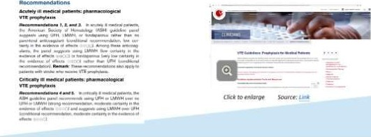 (元のファイル名: image68.jpg)
-  (元のファイル名: image69.jpg)
- 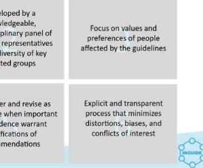 (元のファイル名: image70.jpg)
-  (元のファイル名: image71.jpeg)
-  (元のファイル名: image72.jpg)
-  (元のファイル名: image73.jpg)
-  (元のファイル名: image74.jpg)
-  (元のファイル名: image75.jpg)
-  (元のファイル名: image76.jpg)
-  (元のファイル名: image77.jpg)
-  (元のファイル名: image78.jpg)
-  (元のファイル名: image79.jpg)
-  (元のファイル名: image80.jpg)
-  (元のファイル名: image81.jpg)
-  (元のファイル名: image82.jpg)
- 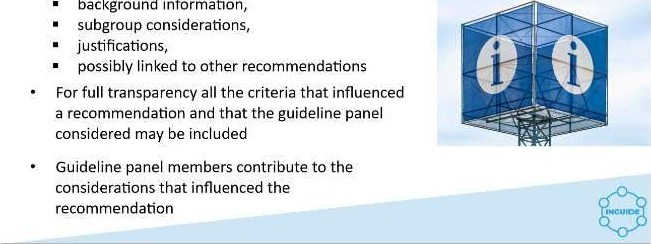 (元のファイル名: image83.jpg)
-  (元のファイル名: image84.jpg)
-  (元のファイル名: image85.jpg)
-  (元のファイル名: image86.jpg)
-  (元のファイル名: image87.jpg)
-  (元のファイル名: image88.jpg)
-  (元のファイル名: image89.jpg)
-  (元のファイル名: image90.jpg)
-  (元のファイル名: image91.jpg)
- 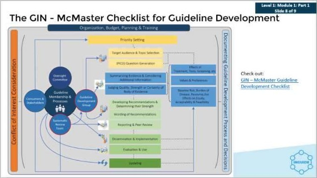 (元のファイル名: image92.jpg)
- 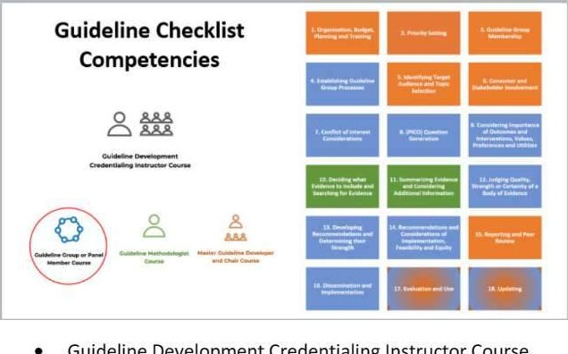 (元のファイル名: image93.jpg)
-  (元のファイル名: image94.jpeg)
-  (元のファイル名: image95.jpg)
-  (元のファイル名: image96.jpg)
-  (元のファイル名: image97.jpg)
-  (元のファイル名: image98.jpg)
-  (元のファイル名: image99.jpg)
-  (元のファイル名: image100.jpg)
-  (元のファイル名: image101.jpg)
-  (元のファイル名: image102.jpeg)
-  (元のファイル名: image103.jpeg)
-  (元のファイル名: image104.jpg)
-  (元のファイル名: image105.jpg)
- 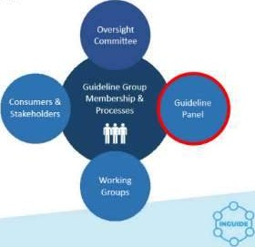 (元のファイル名: image106.jpg)
- 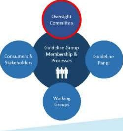 (元のファイル名: image107.jpg)
-  (元のファイル名: image108.jpg)
-  (元のファイル名: image109.jpg)
-  (元のファイル名: image110.jpg)
-  (元のファイル名: image111.jpg)
-  (元のファイル名: image112.jpg)
-  (元のファイル名: image113.jpg)
-  (元のファイル名: image114.jpeg)
-  (元のファイル名: image115.jpg)
-  (元のファイル名: image116.jpg)
-  (元のファイル名: image117.jpg)
-  (元のファイル名: image118.jpg)
-  (元のファイル名: image119.jpg)
-  (元のファイル名: image120.jpg)
-  (元のファイル名: image121.jpg)
-  (元のファイル名: image122.jpg)
-  (元のファイル名: image123.jpg)
-  (元のファイル名: image124.jpg)
-  (元のファイル名: image125.jpg)
-  (元のファイル名: image126.jpg)
-  (元のファイル名: image127.jpg)
-  (元のファイル名: image128.jpg)
-  (元のファイル名: image129.jpg)
-  (元のファイル名: image130.jpg)
-  (元のファイル名: image131.jpg)
-  (元のファイル名: image132.jpg)
-  (元のファイル名: image133.jpg)
- 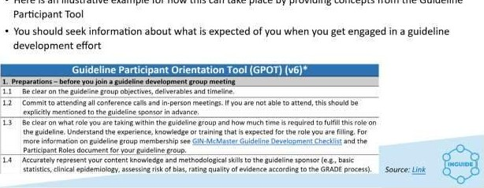 (元のファイル名: image134.jpg)
-  (元のファイル名: image135.jpeg)
-  (元のファイル名: image136.jpg)
-  (元のファイル名: image1.jpeg)
-  (元のファイル名: image2.jpeg)
-  (元のファイル名: image137.jpg)
- 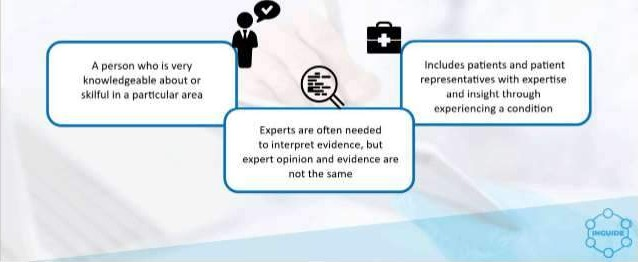 (元のファイル名: image138.jpg)
-  (元のファイル名: image139.jpg)
-  (元のファイル名: image140.jpg)
-  (元のファイル名: image141.jpg)
-  (元のファイル名: image142.jpg)
-  (元のファイル名: image143.jpg)
-  (元のファイル名: image144.jpg)
-  (元のファイル名: image145.jpg)
-  (元のファイル名: image146.jpg)
-  (元のファイル名: image147.jpg)
-  (元のファイル名: image148.jpg)
-  (元のファイル名: image3.jpg)
-  (元のファイル名: image4.jpeg)
-  (元のファイル名: image5.jpg)
-  (元のファイル名: image6.jpg)
-  (元のファイル名: image7.jpg)
-  (元のファイル名: image8.jpg)
-  (元のファイル名: image149.jpg)
-  (元のファイル名: image150.jpg)
-  (元のファイル名: image151.jpg)
-  (元のファイル名: image152.jpg)
-  (元のファイル名: image153.jpeg)
-  (元のファイル名: image154.jpg)
-  (元のファイル名: image155.jpg)
-  (元のファイル名: image156.jpg)
-  (元のファイル名: image157.jpg)
-  (元のファイル名: image158.jpg)
-  (元のファイル名: image159.jpg)
-  (元のファイル名: image160.jpg)
-  (元のファイル名: image161.jpg)
-  (元のファイル名: image162.jpg)
- 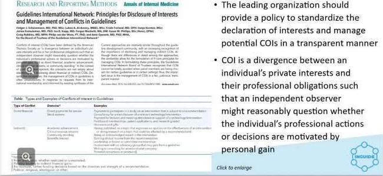 (元のファイル名: image163.jpg)
-  (元のファイル名: image164.jpg)
-  (元のファイル名: image9.jpg)
-  (元のファイル名: image10.jpg)
-  (元のファイル名: image11.jpg)
-  (元のファイル名: image12.jpg)
-  (元のファイル名: image13.jpg)
-  (元のファイル名: image14.jpg)
-  (元のファイル名: image165.jpg)
- 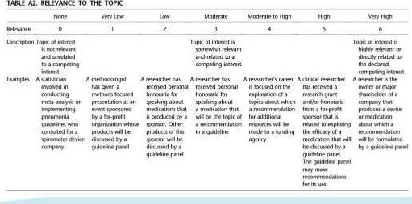 (元のファイル名: image166.jpg)
-  (元のファイル名: image167.jpg)
-  (元のファイル名: image168.jpg)
- 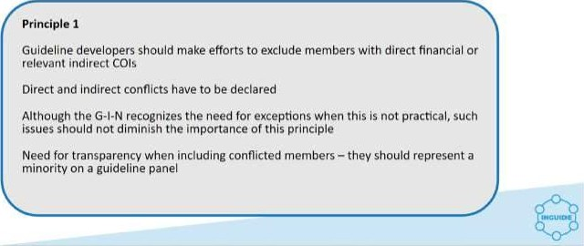 (元のファイル名: image169.jpg)
-  (元のファイル名: image170.jpg)
-  (元のファイル名: image171.jpg)
- 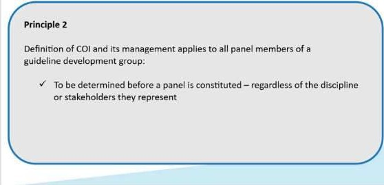 (元のファイル名: image172.jpg)
-  (元のファイル名: image173.jpg)
-  (元のファイル名: image15.jpg)
-  (元のファイル名: image175.jpeg)
-  (元のファイル名: image176.jpg)
-  (元のファイル名: image177.jpg)
-  (元のファイル名: image178.jpg)
- 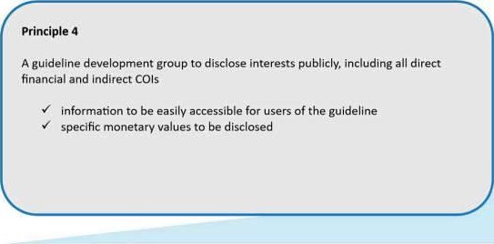 (元のファイル名: image179.jpg)
-  (元のファイル名: image180.jpg)
-  (元のファイル名: image181.jpg)
- 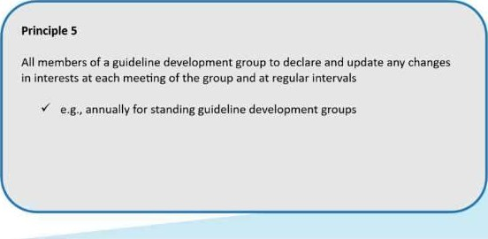 (元のファイル名: image182.jpg)
-  (元のファイル名: image183.jpg)
- 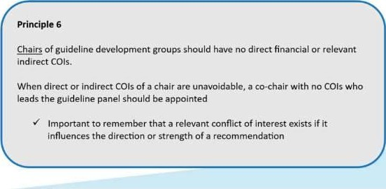 (元のファイル名: image184.jpg)
-  (元のファイル名: image185.jpg)
- 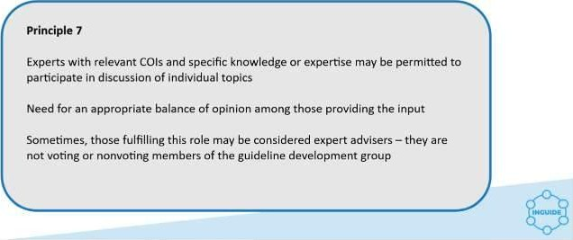 (元のファイル名: image186.jpg)
-  (元のファイル名: image187.jpg)
-  (元のファイル名: image188.jpg)
-  (元のファイル名: image189.jpg)
- 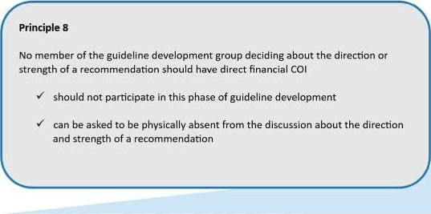 (元のファイル名: image190.jpg)
-  (元のファイル名: image191.jpg)
-  (元のファイル名: image192.jpg)
- 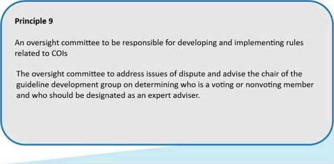 (元のファイル名: image193.jpg)
-  (元のファイル名: image16.jpg)
-  (元のファイル名: image17.jpg)
-  (元のファイル名: image18.jpg)
-  (元のファイル名: image19.jpg)
-  (元のファイル名: image20.jpg)
-  (元のファイル名: image21.jpg)
-  (元のファイル名: image194.jpg)
-  (元のファイル名: image22.jpg)
-  (元のファイル名: image23.jpeg)
-  (元のファイル名: image24.jpg)
-  (元のファイル名: image25.jpg)
-  (元のファイル名: image26.jpg)
-  (元のファイル名: image27.jpg)
-  (元のファイル名: image28.jpg)
-  (元のファイル名: image29.jpg)
- 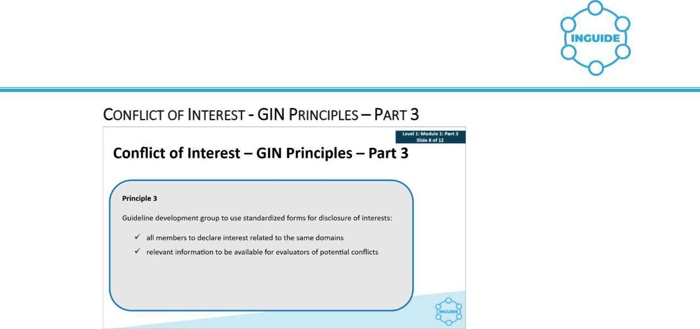 (元のファイル名: image174.jpg)
-  (元のファイル名: image30.jpg)
-  (元のファイル名: image31.jpg)
-  (元のファイル名: image32.jpg)
-  (元のファイル名: image33.jpg)
-  (元のファイル名: image34.jpg)
-  (元のファイル名: image35.jpeg)
-  (元のファイル名: image36.jpg)
-  (元のファイル名: image37.jpg)
-  (元のファイル名: image38.jpg)
-  (元のファイル名: image39.jpg)
- 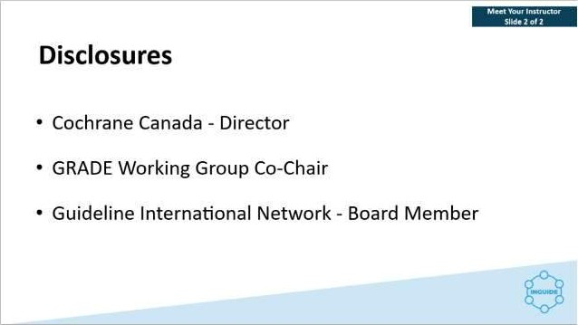 (元のファイル名: image40.jpg)
-  (元のファイル名: image41.jpeg)
-  (元のファイル名: image42.jpg)
-  (元のファイル名: image43.jpg)
-  (元のファイル名: image44.jpg)
-  (元のファイル名: image45.jpeg)
-  (元のファイル名: image46.jpg)
-  (元のファイル名: image47.jpg)
-  (元のファイル名: image48.jpg)
-  (元のファイル名: image49.jpeg)
-  (元のファイル名: image50.jpg)
-  (元のファイル名: image51.jpg)
- 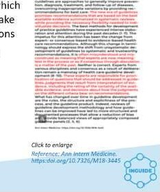 (元のファイル名: image52.jpg)
-  (元のファイル名: image53.jpg)
-  (元のファイル名: image54.jpg)
-  (元のファイル名: image55.jpg)
-  (元のファイル名: image56.jpg)
- 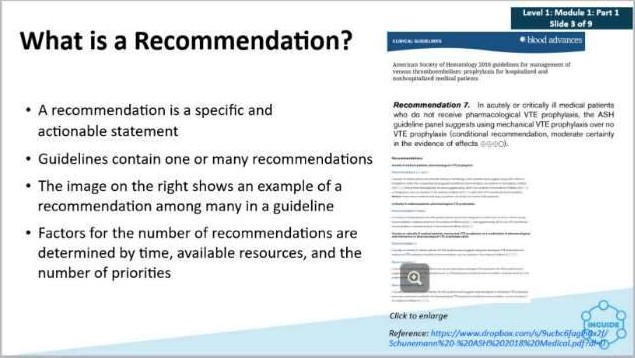 (元のファイル名: image57.jpg)
-  (元のファイル名: image58.jpg)
-  (元のファイル名: image59.jpg)
-  (元のファイル名: image60.jpg)
-  (元のファイル名: image61.jpg)
-  (元のファイル名: image62.jpg)
-  (元のファイル名: image63.jpg)
-  (元のファイル名: image64.jpg)
-  (元のファイル名: image65.jpg)
-  (元のファイル名: image66.jpg)
-  (元のファイル名: image67.jpg)
