# 抽出された文章

INGUIDE Level 1: Module 02

CONTENTS

PART 1: GUIDELINE DEVELOPMENT PROCESS . 2 The GIN-McMaster Checklist for Guideline Development .

Guidelines and Questions

Generating the Right Questions for Guideline Recommendations ................ .

Topics, Guideline Questions, Evidence Review Questions and Recommendations ....... 6 Factors that Influence if a Question is Important........................................

8

.......

11

Typical

Guideline

Types of

Formulating Questions

Guideline and Evidence Review Questions........................................................... ....... 12

PICO Question Generation — Pitfalls ......... .

....

....

18

You Have Completed Part 1 .

PART 2: THE OUTCOMES........ .

The Outcomes ..................................................... .

Which Outcomes Should We Consider? ....................................... 	19

Balancing Desirable and Undesirable Health Effects ...20

Benefits and Harms — 21

Relative Importance of Outcomes ............................ ............	— 22

Approach to Outcome Rating................................ 23

Hierarchy of Outcomes ................................................................................................. 24

Outcome Should be important for decision making............ ....... ... 25

Framing Questions and Selecting Outcomes ..................................................... .......... 27

You Have Completed Part 2 .— 29

# PART 1: GUIDELINE DEVELOPMENT PROCESS

International Guideline Development Credentaling & Certfication Program

# THE GIN-MCMASTER CHECKLIST FOR GUIDELINE DEVELOPMENT

Check online: GIN — McMaster Guideline Development Checklist

We now refer back to this overview of the guideline development process, and in particular, we will focus on question generation.

# GUIDELINES AND QUESTIONS

- Guidelines are a way of answering questions about: o Clinical interventions o Communication interventions o Organizational interventions o Policy interventions
- Hoping to improve health care or health policy
NOTE: It is therefore helpful to structure a guideline in terms of answerable questions with a focus on relevant outcomes

Guidelines are a way of answering questions about clinical, communication, organizational or policy interventions in the hope of improving healthcare or health policy.

# GENERATING THE RIGHT QUESTIONS FOR GUIDELINE RECOMMENDATIONS

1: Volute

10

Generating the Right Questions for Guideline Recommendations

Good questions lead to good recommendations

Attenticn

Good questions lead to good recommendations

- Attention
- Understanding of key components
The important message is that good questions lead to good recommendations.

Therefore, the process of question development requires attention and understanding of the key components that lead to good guideline questions.

# TOPICS, GUIDELINE QUESTIONS, EVIDENCE REVIEW QUESTIONS AND RECOMMENDATIONS

Topics, Guideline Questions, Evidence

Review Questions and Recommendations

("11 n) quest-rms

•

A

topic

descfibes

the

ganerel

area

of

the

guideline

E.E„

Dreasl

carcer

screennganc

Clagnosls

(a;

opposec

lc

al;

ot

oreast

cancer

czr2)

- TOPICS
- GUIDELINE QUESTIONS
- EVIDENCE REVIEW QUESTIONS
- RESULTING RECOMMENDATIONS
- A topic describes the general area of the guideline o E.g., breast cancer screening and diagnosis (as opposed to all of breast cancer care)
- Guideline question — "should" question - population, intervention, comparison o E.g., should A or B be used for people with X?
- Evidence (systematic) reviews — population, intervention, comparison, outcomes
(PICO) questions o In people with X, what is the impact of A compared with B on outcomes 1, 2,

- What value do people with X place on outcomes 1, 2, 3?
- In people with X, how cost effective is intervention A compared with B?
- In people with X, is intervention A compared with B feasible to implement?
- Recommendation - provide the answers to the "should" questions o In people with X, the guideline panel recommends/suggests using A rather than B
It is helpful to distinguish between topics, guideline questions, evidence review questions, and the resulting recommendations. The topic describes the general area for a guideline. For example, it would focus on breast cancer screening and diagnoses as opposed to all aspects of care around breast cancer. Guideline questions are typically "should" questions. For example, should A or B be used for people with X.

These questions define the population, interventions, and the comparison.

Evidence or systematic review questions also focus on the population, interventions, and comparisons but also pay a great deal of attention to the outcomes. For example, in people with X what is the impact of A compared with B on outcomes 1, 2, 3, and so on. It is important to note that evidence reviews and guidelines not only address questions around the impact of an intervention on outcomes but also focus on other aspects that are relevant for making a recommendation. For example, what value do people with condition X place on outcomes 1, 2, 3, and so on.

Or, in people with X, how cost-effective is intervention A compared with intervention B. Or, in people with X, is intervention A compared with intervention B feasible to implement.

Essentially all evidence that is considered in a guideline and recommendation can undergo systematic evaluations through systematic reviews.

Finally, the recommendation provides the answer to the should question. For example, in people with X the guideline panel recommends or suggests using intervention A rather than intervention B.

# FACTORS THAT INFLUENCE IF A QUESTION IS IMPORTANT

1: Volute

Factors that Influence if a Question is Important

10

- Common question in practice?
- Uncertainty in practice?
- New evidence to consider?
- Variation in practice?
- Consequences for resource use/cost?
- Not previously or sufficiently addressed?
As we are deciding on the importance of the questions, and the questions that should be answered, there are six broader categories that influence if a question is really an important one.

- Is the question common practice?
- Is there uncertainty in practice?
- Was the question already raised, but there is a lot of new evidence to consider?
- Is there big variation in practice, which means that there may be legitimate variation, but which could also mean that the information about the recommendations or for the recommendation have not been clearly provided.
- Are there big consequences for resources or cost?
- And finally, if the question has not been previously or sufficiently addressed, then those are reasons for prioritizing a question.
## TYPES OF QUESTIONS

1: Volute

Gof 10

Types of Questions

cancer

be

used?

Background questions

- Definition: What is cervical cancer?
- Mechanism: What is the mechanism with which human papilloma virus cause cervical cancer?
Foreground guideline questions

- Intervention: In women aged 20 to 60, should screening for human papilloma virus for cervical cancer be used?
There are many different questions that could be asked as part of the guideline development process. It is important to distinguish:

- A question that serves to describe the background of the condition or disease or mechanisms related to how a condition or a disease either arises or can be treated.
- From 2 questions that we call foreground guideline questions, which can be answered through action-oriented guideline recommendations.
For example, the guideline on cervical cancer may describe the definition of cervical cancer and how cancer is caused by human papilloma virus. This may be of interest to the user of the guideline but neither of these questions leads to action-oriented statements such as recommendations. On the other hand, a foreground question "In women aged 20 to 60 should screening for human papilloma virus for cervical cancer be used?" Will lead to a recommendation for or against screening as a result of a deliberative process that will be the focus of this course.

# FORMULATING QUESTIONS

## Formulating Questions

X?

be used in people with

- Should Aor B be used in people with X?
- Should drug A or drug B be used in people with X?
- Should program A or program B be used in people with X?
- Should test A (and treatment) or test B (and treatment) be used in people with X?
I'll take you through some of the key issues that you may or may not be familiar with as you formulate questions. A simple format for a question is "should A or B be used in people or patients with condition X". For instance, when we talk about medications, the question could be: should drug A or drug B be used in people with a certain condition? But it also could be a type of educational program or a health policy intervention compared to something else in a target population. When you think of tests, the question could be: should test A or test B be used in a specific target population?

Something to note though when you formulate a question about whether to use a test or not or test versus another test is typically, we are not testing for the purpose of testing. Instead, we want to know if we should use one test or another or none to decide whether to administer or suggest some form of treatment or other options down the line. So, the question is still 'should test A or test B be used?' but we will need to think about the outcomes that can occur after treatment or other options based on the results of that test.

## TYPICAL GUIDELINE QUESTIONS

Should

oral

immunotherapy

compared

to

all

immunotherapy

be

used

in

children

with cow's milk allergy?

Should low molecular weight heparin be used in patients with cancer? Should human papillomavirus testing or visual inspection with acetic acid be used to screen for cervical cancer?

Typical guideline questions could be as follows: Should oral immunotherapy, compared with all immunotherapy, be used in children with cow's milk allergy? A common condition in children.

Or, should low molecular weight heparin be used in patients with cancer? Or, should human papilloma virus testing or visual inspection with acetic acid be used to screen for cervical cancer?

# GUIDELINE AND EVIDENCE REVIEW QUESTIONS

1: Volute

'of 10

Guideline and Evidence Review Questions

Population, Intervaltion, Comparison, Outcomes (PICO)

• popula*n: Describe t8e population in a: much detail es necesserv fcrtlle recommendet-;on

(e.g., age, gender, cc-morbidities, hospitalized, etc)tor the guideline question

- eoidence review one should define how narrcw cr broad th2 included population can be
- Describe the ore ormore interventions in as much detail as necessary (e.g„ which 	is
- Comparator: Ocscribc the altcrnativc (e.g., no active treatment, Mother treatment, a diffcrent test, alternative præram)
- Outcomes: Des:ribc the main outcomcz that determine the dcci:icn 	internaticrs
(e.g., mcrtaity, morb:city, quality of lifel

Population, Intervention, Comparison, Outcomes (PICO)

- Population: Describe the population in as much detail as necessary for the recommendation (e.g., age, gender, co-morbidities, hospitalized, etc.) for the guideline question o For evidence review one should define how narrow or broad the included population can be
- Intervention(s): Describe the one or more interventions in as much detail as necessary (e.g., which medication, which program, how the test is done)
- Comparator: Describe the alternative (e.g., no active treatment, another treatment, a different test, an alternative program)
- Outcomes: Describe the main outcomes that determine the decision about the intervention (e.g., mortality, morbidity, quality of life)
You will be asked to help identify the guideline evidence review questions based on the PICO framework. This is not a simple task and often requires very careful consideration and close interaction between panel members, the panel chairs, and other groups involved. The question formulation process involves describing:

The population: you will be asked to help describe the population in as much detail as necessary for the recommendation.

Characteristics that will be looked for may be related to age, gender, comorbidities, whether people are hospitalized or ambulatory. This will then help the evidence review team to apply either narrow or broader inclusion criteria to ensure the question can be informed by evidence.

The intervention: you will be asked to help describe the intervention that you are interested in, in as much detail as necessary. For example, which medication, which program, or how to test, that maybe of interest to those who practice.

The comparator: you may be asked to describe the alternative to the intervention in detail.

This could be no active treatment, which in the case in many medications and best represented by placebo, another treatment, a different test, or an alternative program. The outcomes: there's hardly ever a single outcome that determines the direction or strength of the recommendation in order to answer the question appropriately. You will be asked to help describe the main outcomes that determine the decisions about an intervention. For example, this may include mortality, morbidity, quality-of-life, adverse outcomes, etc.

## PICO QUESTION GENERATION — PITFALLS

10

PICO Question Generation — Pitfalls

- Generafng a full list of potentially important questions independently or in collaboration withthe other pane' members
- Rating the relative importance of the full listof potential questions independently o Discussin% and aereeinE on the importance ratings for the quest-ions
- Selecting the main outcomes to determine the health benefits and harms far the selectee questions
- Generating a full list of potentially important questions independently or in collaboration with the other panel members
- Rating the relative importance of the full list of potential questions independently
- Discussing and agreeing on the importance ratings for the questions
- Selecting the main outcomes to determine the health benefits and harms for the selected questions
Potential pitfalls in this process include:

- Not rigorously following the PICO frameworkReducing a large list of questions that are important from different perspectives to a feasible listNot having a clear process to reach consensus
- Not rigorously following the PICO framework
- Reducing a large list of questions that are important from different perspectives to a feasible list
- Not having a clear process to reach consensus
Guideline panel members will typically be involved in the following steps to select questions for the guideline:

- Generating a full list of potentially important questions, independently, or in collaboration with the other panel members, using the Population, Intervention, Comparator, and Outcomes approach.Rating the relative importance of the full list of potential questions independently from the other panel members, using the PICO approach.
- Generating a full list of potentially important questions, independently, or in collaboration with the other panel members, using the Population, Intervention, Comparator, and Outcomes approach.
- Rating the relative importance of the full list of potential questions independently from the other panel members, using the PICO approach.
Discussing and agreeing on the importance ratings for the questions with the panel to reach consensus on a final list of questions.

- And, selecting the main outcomes. For example, the critical and important outcomes, that determine the health benefits and harms for the selected questions, and to complete the PICO framework.
- And, selecting the main outcomes. For example, the critical and important outcomes, that determine the health benefits and harms for the selected questions, and to complete the PICO framework.
Guideline panels often have limited time and resources, and focusing on a feasible list with the most important PICO questions is essential. Panel members play a vital role in this process.

Potential pitfalls in this process include:

- not rigorously following the PICO framework,  reducing a large list of questions that are important from different perspectives to a feasible list, and, not having a clear process to reach consensus.
- not rigorously following the PICO framework,  reducing a large list of questions that are important from different perspectives to a feasible list, and, not having a clear process to reach consensus.
# You HAVE COMPLETED PART 1

You have completed Part 1!

Part 2 will review the outcomes.

You have completed Part 1!

Part 2 will review the outcomes.

PART 2: THE OUTCOMES

# THE OUTCOMES

## The Outcomes

0000 PICO, Harms, Benefits

- Should be able to determine if the balance of the health benefits and harms favoursthe intervention of interest or not
- Need to know the population, intervention, and comparator before selecting the outcomes
- The panel should Start thinking about the impoåant outcomes for decision making that reflects the benefits and harms
PICO, Harms, Benefits

- Should be able to determine if the balance of the health benefits and harms favors the intervention of interest or not
- Need to know the population, intervention, and comparator before selecting the outcomes
- The panel should start thinking about the important outcomes for decision making that reflect the benefits and harms
We also need to consider that with all selected outcomes, we should be able to determine whether the balance of the health benefits and harms, including the burden that may be associated with the intervention, favors the intervention of interest or not. This means that we need to know the Population, Intervention and Comparator before selecting our outcomes.

During the previously described process of selecting questions, the panel should start thinking about the potentially important outcomes for decision making that reflect the benefits and harms.

WHICH OUTCOMES SHOULD WE CONSIDER?

Which Outcomes Should we Consider?

Not everything that is important is measured, and not everything that is measured is important

Not everything that is important is measured, and not everything that is measured is important

We are returning to the issue about which outcomes should be considered and the following sentence explains it. Not everything that is important is measured and not everything that is measured is actually important for decision-making

# BALANCING DESIRABLE AND UNDESIRABLE HEALTH EFFECTS

## Balancing Desirable and Undesirable Health Effects

Condition.'

For vs Against: Effects & $ x values (importance)

Conditional vs Strong: Effects & $ x values (importance)

The balance between the desirable and undesirable effects is determined by how large the effects of an intervention are and how important the outcomes are. The more important the outcome and the more of them are avoided or caused by the intervention, the larger will be the overall effect. When bad outcomes are not important, even if many

of them are prevented, they provide less beneficial effects than if they are important. Furthermore, a few very, but very important bad outcomes avoided may provide more net desirable health effects than if they are not important.

# BENEFITS AND HARMS

1: Volute

Benefits and Harms

00esirable outcomes

mortality

- ReclLC2d hospital ;tay
- Redced duration cf diseasæ	The d2'Äopment of resi5tence
outcomes

Improvement quality of life or Ymptcms	• Worsening oi quality of life or

Every decision comes with desirable and undesirable health outcomes

Developing recommendatons must irclud2 a consideration of desirable and undesirable cutcomes ane Dar cart-idence in the effects 0+ interventions On

WLL.unes

Desirable outcomes

- Lower mortality
- Reduced hospital stays
- Reduced duration of disease
- Improvement of quality of life or symptoms
Undesirable outcomes

- Higher mortality
- Adverse reactions
- The development of resistance
- Worsening of quality of life or symptoms
Every decision comes with desirable and undesirable health outcomes

- Developing recommendations must include a consideration of desirable and undesirable outcomes and our confidence in the effects of interventions on the outcomes
Interventions or options in healthcare cause direct benefits and harms. We typically distinguish desirable health outcomes from undesirable health outcornes. Examples of desirable outcomes are lowering mortality reducing hospital stay or duration of stay, or reducing the duration of disease, improving quality of life or symptoms. Undesirable health outcomes are for instance higher mortality, adverse reactions, or the development of antimicrobial resistance, worsening of quality-of-life, or symptoms. Every decision comes with desirable and undesirable health outcomes and developing recommendations must include considerations around these outcomes and how confident we are in the effects of interventions on these outcomes.

# RELATIVE IMPORTANCE OF OUTCOMES

## Relative Importance of Outcomes

- Decision makers (and guideline authors) need to consider the relative importance of outcomes when balancing these outcomes to make
- Relative Importance varies across populations
- Relative importance mav vary across patient groups within the same population
- When the outcome is considered critical - include in the evaluation
- Decision makers (and guideline authors) need to consider the relative importance of outcomes when balancing these outcomes to make a recommendation
- Relative importance varies across populations
- Relative importance may vary across patient groups within the same population
- When the outcome is considered critical - include in the evaluation
In order to weight the desirable and undesirable health outcomes, decision-makers and guideline authors need to consider the relative importance of these outcomes. The relative importance of outcomes may vary across populations and it may vary across patients in the some population. However, whenever an outcome is considered critical for decision-making it should be evaluated in the balancing of benefits and harms.

APPROACH TO OUTCOME RATING

a

7

tot deciabnmak"g

6

4

## Approach to Outcome Rating

- Focus on outcomes critical or important for decision making
- Ideally no more tian 7 outcomes
1—3 -5 Of low importance

4—6 Important, but not critical for decision making

7—9 -5 Critical for decision making

- Focus on outcomes critical or important for decision making
- Ideally no more than 7 outcomes
Typically, there's a limit to how many outcomes guideline panel members can deal with in decision making, and we suggest to really focus in on those that are critical or important for decision making and this is typically not more than seven outcomes. One approach to addressing the importance of outcomes is to conduct ratings similar to what is shown here. For example, using of 1 to 9 rating scale with anchors that provide information such as being critical for decision-making, important but not critical for decision-making, and of low importance for decision-making.

# HIERARCHY OF OUTCOMES

1: Volute

Hospital adm—on, allerøe

Morally

Pnm•moni'

aide 7

Hierarchy of Outcomes

• Accordingto their importance to assess the effect ot immunization In people to prevent influenza

SKn reamon • itching

fcr

Na=ea 2

According to their importance to assess the effect of immunization in people to prevent influenza

1— 3 (Nausea) 	Of low importance

4— 6 (Skin reaction — itching) Important, but not critical for decision making 7 (Pneumonia), 8 (Hospital admission, allergic reactions), 9 (Mortality) -i Critical for decision making

Here's an example about the effects of immunization to prevent influenza: Mortality, hospital admission and allergic reactions as well as pneumonia may be the critical outcomes and skin reactions and itching as side effects important but not critical. Nausea maybe of low importance. This exemplifies the distinction between critical, important, and non-important outcomes for decision making.

OUTCOME SHOULD BE IMPORTANT FOR DECISION MAKING

## Outcome Should be Important for Decision Making

Typically up to 7 outcomes

Outcome 1

Outcome 2

Outcome 3

Outcome 4 — No evidence, therefore surrogate outcome used

Outcome 5

Outcome 6

Outcome 7

Potential pitfalls and challenges

- Not explicitly providing definitions of the outcomes under consideration
- Reducing a large list of outcomes considered important from different perspectives to an appropriate list
- Required consensus typically achieved by those who guide the process
Outcomes should be decided by importance NOT by what evidence we expect is available

Outcome 1

Outcome 2

Outcome 3

Outcome 4

Outcome 5 Outcome 6

Outcome 7

The final list of outcomes per question should be important for decision making, which means they should matter to people for (e.g., in public health questions) or patients.

Typically, there is a limit to how many outcomes we can consider in our head, or even in an analytical model, and no more than 7 outcomes are typically suggested for inclusion. If the selected outcomes may not be adequately measured or reported in the research studies, suitable surrogate outcomes can be pre-specified for consideration. These surrogate outcomes usually lower our certainty in the evidence. In addition, when discussing the evidence for a question, all selected outcomes should be considered explicitly, including the absence of such evidence.

Potential pitfalls and challenges in this process include:

- Not explicitly providing definitions of the outcomes under consideration.
- Reducing a large list of outcomes that may be considered important from different perspectives to an appropriate and feasible list.
- And consensus will be required and that is typically achieved by those who guide the process.
The determination of which outcomes should be considered is often complex You can contribute to this process as a panel member. In fact, your contributions will be critical. The first rule is that outcomes should be driven by their importance, not by what evidence you might expect to be available.

# FRAMING QUESTIONS AND SELECTING OUTCOMES

Framing Questions and Selecting Outcomes

Include a range of outcomes, addressing benefit and harms

- panels need to corsider CJtC0mes for decision makira, even if addressed by
- Must adress kev outcomes, such as harms, 	With an intervention
Guideline panels should facus an all potential patient-important outcomes

- Classify outcomes regarding importance for Cecisior naking (critical, important but rot critcal, of limited importance)
- Consideration of outcomes Important to others (resources paid for by third parties, equily consider-atons, irngatLs cn those 	care for patients. publi: health impacts)
Guidelineeevelopers must base the choice of outcomes on what is important; and not on what outcomes are measured

Include a range of outcomes, addressing benefit and harms

- Guideline panels need to consider all outcomes for decision making, even if addressed by surrogates
- Must address key outcomes, such as harms, associated with an intervention
Guideline panels should focus on all potential patient-important outcomes

- Classify outcomes regarding importance for decision making (critical, important but not critical, of limited importance)
- Consideration of outcomes important to others (resources paid for by third parties, equity considerations, impacts on those who care for patients, public health impacts)
Guideline developers must base the choice of outcomes on what is important, and not on what outcomes are measured

Given that recommendations cannot be made on the basis of information about single outcomes and decision-making always involves a balance between health benefits and harms, authors of systematic reviews will make their reviews more useful by looking at a comprehensive range of outcomes that allow decision making in health care. Many, if not most, systematic reviews fail to address some key outcomes, particularly harms, associated with an intervention.

On the contrary, to make sensible recommendations guideline panels must consider all outcomes that are important or critical to patients or people for decision making. In addition, they may require consideration of outcomes that are important to others, including the use of resources paid for by third parties, equity considerations, impacts on those who core for patients, and public health impacts such as, the spread of infections or antibiotic resistance.

Guideline developers must base the choice of outcomes on what is important, and not on what outcomes are measured or for which evidence is available. If evidence is lacking for an important outcome, this should be acknowledged, rather than ignoring the outcome. Because most systematic reviews do not summarize the evidence for all important outcomes, guideline panels must often either use multiple systematic reviews from different sources, or conduct their own systematic reviews or update existing reviews.

# You HAVE COMPLETED PART 2

You have completed Part 2!

Goto Module 3 in Vour Level 1 Course

You have completed Part 2!

Go to Module 3 in your Level 1 Course.

---
## 抽出された図のインデックス

- 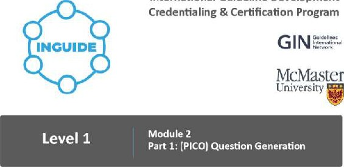 (元のファイル名: image12.jpg)
-  (元のファイル名: image1.jpeg)
-  (元のファイル名: image105.jpg)
-  (元のファイル名: image106.jpg)
- 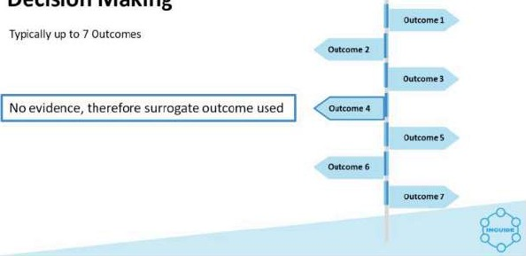 (元のファイル名: image107.jpg)
-  (元のファイル名: image2.jpg)
-  (元のファイル名: image3.jpeg)
-  (元のファイル名: image4.jpg)
-  (元のファイル名: image5.jpg)
-  (元のファイル名: image6.jpeg)
-  (元のファイル名: image7.jpg)
-  (元のファイル名: image8.jpg)
-  (元のファイル名: image9.jpg)
-  (元のファイル名: image10.jpg)
-  (元のファイル名: image11.jpg)
-  (元のファイル名: image27.jpg)
-  (元のファイル名: image13.jpg)
- 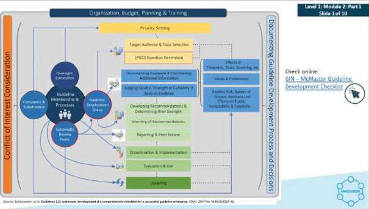 (元のファイル名: image14.jpg)
-  (元のファイル名: image15.jpg)
-  (元のファイル名: image16.jpeg)
-  (元のファイル名: image17.jpg)
-  (元のファイル名: image18.jpg)
-  (元のファイル名: image19.jpg)
-  (元のファイル名: image20.jpg)
-  (元のファイル名: image21.jpg)
- 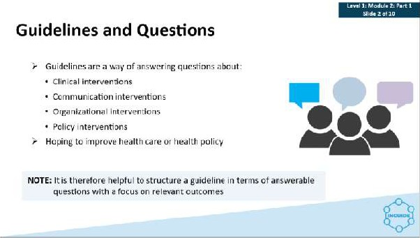 (元のファイル名: image22.jpg)
-  (元のファイル名: image23.jpg)
-  (元のファイル名: image24.jpg)
-  (元のファイル名: image25.jpg)
-  (元のファイル名: image26.jpg)
-  (元のファイル名: image108.jpg)
-  (元のファイル名: image28.jpg)
-  (元のファイル名: image29.jpg)
-  (元のファイル名: image30.jpg)
- 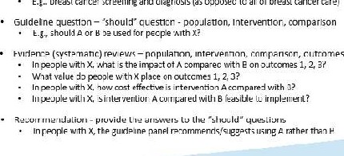 (元のファイル名: image31.jpeg)
-  (元のファイル名: image32.jpg)
-  (元のファイル名: image33.jpg)
-  (元のファイル名: image34.jpg)
-  (元のファイル名: image35.jpg)
-  (元のファイル名: image36.jpg)
-  (元のファイル名: image37.jpg)
-  (元のファイル名: image38.jpg)
- 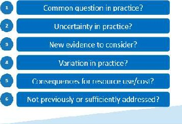 (元のファイル名: image39.jpg)
-  (元のファイル名: image40.jpg)
-  (元のファイル名: image41.jpg)
-  (元のファイル名: image42.jpg)
- 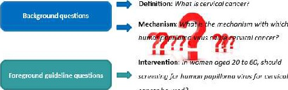 (元のファイル名: image43.jpeg)
-  (元のファイル名: image44.jpg)
-  (元のファイル名: image45.jpg)
- 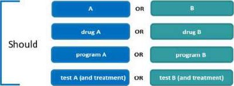 (元のファイル名: image46.jpg)
-  (元のファイル名: image47.jpg)
-  (元のファイル名: image48.jpg)
-  (元のファイル名: image49.jpg)
-  (元のファイル名: image50.jpg)
-  (元のファイル名: image51.jpg)
- 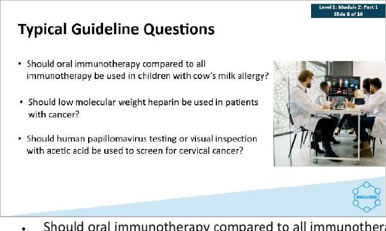 (元のファイル名: image52.jpeg)
-  (元のファイル名: image53.jpg)
-  (元のファイル名: image54.jpg)
-  (元のファイル名: image55.jpg)
-  (元のファイル名: image56.jpg)
-  (元のファイル名: image57.jpg)
-  (元のファイル名: image58.jpg)
-  (元のファイル名: image59.jpg)
-  (元のファイル名: image60.jpg)
-  (元のファイル名: image61.jpg)
-  (元のファイル名: image62.jpg)
-  (元のファイル名: image63.jpg)
-  (元のファイル名: image64.jpg)
-  (元のファイル名: image65.jpg)
-  (元のファイル名: image109.jpg)
-  (元のファイル名: image110.jpg)
-  (元のファイル名: image111.jpg)
-  (元のファイル名: image112.jpg)
-  (元のファイル名: image72.jpg)
-  (元のファイル名: image68.jpg)
-  (元のファイル名: image73.jpg)
-  (元のファイル名: image70.jpg)
-  (元のファイル名: image71.jpg)
-  (元のファイル名: image74.jpg)
-  (元のファイル名: image67.jpg)
-  (元のファイル名: image66.jpg)
-  (元のファイル名: image75.jpg)
-  (元のファイル名: image76.jpg)
-  (元のファイル名: image77.jpg)
-  (元のファイル名: image78.jpg)
- 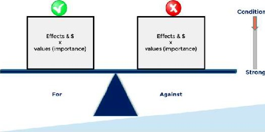 (元のファイル名: image79.jpg)
-  (元のファイル名: image80.jpeg)
-  (元のファイル名: image81.jpg)
- 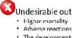 (元のファイル名: image82.jpeg)
-  (元のファイル名: image83.jpg)
-  (元のファイル名: image84.jpg)
-  (元のファイル名: image69.jpg)
-  (元のファイル名: image85.jpg)
-  (元のファイル名: image86.jpg)
-  (元のファイル名: image87.jpg)
-  (元のファイル名: image88.jpg)
-  (元のファイル名: image89.jpg)
-  (元のファイル名: image90.jpg)
-  (元のファイル名: image91.jpg)
-  (元のファイル名: image92.jpg)
-  (元のファイル名: image93.jpg)
-  (元のファイル名: image94.jpg)
-  (元のファイル名: image95.jpg)
-  (元のファイル名: image96.jpg)
-  (元のファイル名: image97.jpg)
-  (元のファイル名: image98.jpg)
-  (元のファイル名: image99.jpg)
-  (元のファイル名: image100.jpg)
- 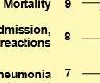 (元のファイル名: image101.jpeg)
-  (元のファイル名: image102.jpg)
-  (元のファイル名: image103.jpg)
-  (元のファイル名: image104.jpg)
-  (元のファイル名: image214.jpg)
-  (元のファイル名: image215.jpg)
