# 抽出された文章

INGUIDE Level 1: Module 03

# CONTENTS

PART 1: HEALTH BENEFITS AND HARMS.	3 GRADE Working Group Process ............................................

Questions ..

Does the Balance of Benefits and Harms Favour Intervention or Not?.

Importance of an Outcome ...................................................................

Example of Rating for Outcome Pulmonary Embolism.................................. . . .. 	10

Desirable and Undesirable Consequences................................................................... Il

GRADE Working Group Process .................... ........... .......... .	..... 12

You Have Completed Part 1 . 13

PART 2: SYSTEMATIC REVIEWS 14

Health Benefits and Harms ..	. ... .... ..... 15

Systematic 16

Why Systematic Reviews? ........................... .... ... 17 Types of Systematic Reviews ...................................................................18

Meta-Analysis...19

Outcome: Pulmonary Embolism .	. .. ... 20

Outcome: Pulmonary Embolism - PARTICIPANTS and EVENTS

21

Outcome.• Pulmonary Embolism - Total Number of Participants and Events............... 22

Outcome: Pulmonary Embolism - Weight .. — ............. 23

Outcome: Pulmonary Embolism - Relative Effective Estimate — Part 1..24

Outcome: Pulmonary Embolism - Relative Effective Estimate - Part 2..... ...... 25

Outcome: Pulmonary Embolism - Scale............................. ...... 26

Outcome.• Pulmonary Embolism - Overall Effect .. 	27

Belief and Confidence. 28

You have completed Part 2! —— 29

PART 3: SUMMARIZING EVIDENCE AND CONSIDERING ADDITIONAL INFORMATION ..... 30

Summarizing Evidence and Considering Additional Information — Evidence .............. 31

Summarizing Evidence and Considering Additional Information — Contextual Factors32

Judging Quality, Strength, or Certainty of a Body of Evidence - Frameworks.... .... ..... 33

Judging Quality, Strength, or Certainty of a Body of Evidence — Frameworks . ....... 34 Certainty of Evidence ............ .36

Heparins in Cancer Patients: Systemic Review of RCTs .........................	..... ..... .... 37 Imprecision 40

Publication bias .  41 Indirectness	42

Inconsistency

...........................................................

........

39

Summary

YOU

HAVE

COMPLETED

PART

3

PART

1:

HEALTH

BENEFITS

AND

HARMS

GRADE WORKING GROUP PROCESS

We will illustrate the process from PICO question generation to recommendation generation with specific examples and using the GRADE working group process to develop a recommendation as you can see here. GRADE is a widely used transparent framework for developing and presenting summaries of evidence and it provides a systematic approach for making health guideline recommendations. Other frameworks exist that you may need to follow to complete these specific steps of the GIN-McMaster Checklist.

GIN-MCMASTER CHECKLIST & GRADE WORKING

GROUP PROCESS

Here you see can which specific GIN-McMaster Checklist steps are covered by the GRADE Working Group process

Deep Vein Thrombosis and Pulmonary Embolism (VTE)

- The risk of VTE is elevated in certain hospitalized patients
- Associated with mortality and morbidity, impairments in function, pain and increased costs
Should a blood thinner, e.g., low molecular weight heparin, be used for venous thromboembolism prophylaxis in acutely ill hospitalized medical patients?

We will be using an example that is frequently encountered in patients who are hospitalized in medical wards. Blood clots in patients' legs, also known as deep vein thrombosis, can develop for numerous reasons in hospitalized patients. Blood clots in the leg may cause symptoms including pain, and they may dislocate and cause occlusion of lung vessels, also known as pulmonary embolism, which in turn can lead to death, morbidity, impairment in function, and associated costs. A typical guideline question might be: should a blood thinner, such as low molecular weight heparin, be used for venous thromboembolism prophylaxis in acutely ill hospitalized medical patients?

## QUESTIONS

Questions

Population, Intervention, Comparison, Outcomes (PICO)

Population, Intervention, Comparison, Outcomes (PICO)

- P Population: People who are acutely ill and hospitalized (Subgroups?)
- I 	Intervention: Low molecular weight heparin (Which ones? Define!)
- C * Comparison: No low molecular weight heparin
- O Outcomes: Mortality, thromboembolic events, bleeding (Others?)
To describe the healthcare question, we typically follow the so-called PICO format, as already introduced. It describes the population, intervention, comparison, and outcomes. In the case of our example, the population includes people who are acutely ill and in the hospital. It is good to think about potential subgroups at the question formulation stage. For instance, those with or without an infection. The intervention is anticoagulants, and more specifically, low molecular weight heparin. It is important to be specific which exact heparins are used or of interest, and if other anticoagulants might inform the question. The comparator should be defined, and, in this case, it is NOT using a low molecular weight heparin. Finally, the outcomes that are important for decision-making should be described. In this case, outcomes include mortality, thromboembolic events, and bleeding. Of course, other outcomes may also be of importance.

DOES THE BALANCE OF BENEFITS AND HARMS FAVOUR INTERVENTION

OR NOT?

Does the Balance of Benefits Favour Intervention or Not?

and Harms

Ceep ver. r.hrom'osls

Internal bleeding, Minor (e.g., skin) bleeding, Gastrointestinal bleeding, Pain, Quality of life, Other?

Mortality, Deep vein thrombosis, Pulmonary embolism, Others?

To address the PICO question, we are focusing for now on benefits and harms of the intervention in terms of its effect on health outcomes. What would be listed here, for example, would be major bleeding as a harm, as blood thinners typically increase the risk for major bleeding. Other outcomes would be weight, such as quality of life, mortality, venous thromboembolism, to determine whether they are a harm or a benefit and where the overall balance tips in the end. We're using processes that allow us to identify either from a panel's point of view, or using otherwise available information, which health outcomes may be important for decision making.

## IMPORTANCE OF AN OUTCOME

Importance of an Outcome

Importance or •n Outconw

TASK

Rate the relative importance of the outcome for decision-making (i.e., formulating a recommendation) of each outcome on a scale from 1 to 9. The meaning of the ratings are:

- 1-3 are limited or not important for decision-making
- 4-6 are important, but not critical for decision-making
- 7-9 are critical for decision-making
As previously explained, for all health outcomes that are potentially relevant for the PICO, you will be asked to rate the relative importance of these outcome.

You can use the same rating for different outcomes more than once. You may be asked to make judgments, on a scale from one to nine, about which outcomes should be included for PICO question. Often, you will see these types of scales that may include a rating exercise with the description of the outcome under consideration.

EXAMPLE OF RATING FOR OUTCOME PULMONARY EMBOLISM

Example

Pulmonary

Referring to our example about low molecular weight heparin for prevention of venous thromboembolism, here there would have been 13 panel members on average that participated in the rating exercise, and you can see their ratings here. A severe pulmonary embolism received a mean rating of nine, a moderate pulmonary embolism a rating of eight, and a mild pulmonary embolism a rating of six. Using the mean ratings from this panel, we can then determine that a severe and moderate pulmonary embolism are considered criticalfor decision-making, and that a mild pulmonary embolism is important but not critical.

### DESIRABLE AND UNDESIRABLE CONSEQUENCES

Desirable and Undesirable Consequences

Pro: Benefits, Importance, Low cost, Doable

Against: Harms, Importance High cost, Not doable

Now we know which outcomes are critical for our PICO question, we can look at the evidence to determine if there are important harms and benefits of the intervention when measuring these outcomes. In addition to health effects, we want to know if we are causing high costs, or perhaps whether it is not even doable orfeasible as an intervention. All of this together will be considered to determine desirable and undesirable consequences of the intervention and to generate a recommendation for the PICO question we prioritized as important for practice.

# GRADE WORKING GROUP PROCESS

Here

you

see

again

the

example

of

the

GRADE

Working

Group

process

to

develop

a

recommendation. Following PICO prioritization and outcome selection, we will now move to the systematic review stage to identify eligible studies that address these PICO's and outcomes, synthesize their findings, and rate the certainty of the evidence. As a panel member, you will need to understand what the presented evidence means, with help from your guideline chair and methodologist.

Typically, once a question is formulated, the evidence synthesis team conducts a systematic review or health technology assessment and assesses the individual studies and pieces oj evidence that ore identified, and then provides a synthesis of this evidence in what we often call Evidence Profiles or Summary of Findings tables that present key information about the PICO question. In short, such information includes how many studies were found, how large the effect of the intervention was, or what the test accuracy was that is being explored? How many patients were involved or how many participants were in the studies? How confident can we be in the effects? We summarize these here by providing a rating of the certainty of the evidence for each outcome that was deemed critical or important for decision making.

This information is provided back to the panel, often in the form of an Evidence to Decision or a recommendation framework, that includes not only information about the intervention or the test effects. It should also include evidence about the underlying values and preferences which are related to the important outcomes. Patients should place a high value on an outcome that you rate as critical for decision making and then depending on the framework that is used it may include information about the resources that are required, cost-effectiveness, equity, acceptability, and feasibility related to the intervention and comparator.

## You HAVE COMPLETED PART 1

You have completed Part 1!

Part 2 will describe systematic reviews.

You have completed Part 1!

Part 2 will describe systematic reviews.

PART

2:

SYSTEMATIC

REVIEWS

# HEALTH BENEFITS AND HARMS

Health Benefits and Harms

Now we know the PICO question including outcomes we are interested in, let's start with thinking about finding the evidence for the health benefits and harms. We will use a few examples to make some of the points clearer.

SYSTEMATIC REVIEW

## Systematic Review

What is a systematic review?

A scientific investigation that attempts to collate all empirical evidence that fits pre-specified eligibility criteria to answer a specific research question

It uses explicit, systematic, reproducible methods to minimize bias and random error, thus providing reliable findings from which conclusions can be drawn and decisions made

Meta-analysis is the quantitative synthesis of the results of included studies

What is a systematic review?

A scientific investigation that attempts to collate all empirical evidence that fits prespecified eligibility criteria to answer a specific research question

It uses explicit, systematic, reproducible methods to minimize bias and random error, thus providing reliable findings from which conclusions can be drawn and decisions made

Meta-analysis is the quantitative synthesis of the results of included studies

The best way to address whether an intervention is likely to cause more benefits than harms is by conducting a systematic review of the best available evidence. A systematic review is a scientific investigation that attempts to collate all empirical evidence that fits pre-specified eligibility criteria to answer a specific research question. It uses explicit, systematic, reproducible methods to minimize bias and random error, thus providing reliable findings from which conclusions can be drawn and decisions can be made. A meta-analysis often follows from a systematic review and is a quantitative synthesis of the results of the included studies.

WHY SYSTEMATIC REVIEWS?

Why Systematic Reviews?

Effective & efficient way to assess the body of evidence

- Saves Eme required for searching
- Critical appraisal
- Interpretation cf results
Explore differences between studies

Reliable basis for decision making

- Unbiased  information
- Useful for health care, policy, future research
- Effective & efficient way to assess the body of evidence
- Saves time required for searching
- Critical appraisal
- Interpretation of results
- Explore differences between studies
- Reliable basis for decision making
- Unbiased selection of relevant information
- Useful for health care, policy, future research
Using systematic reviews in guideline development is an effective and efficient way to assess a body of evidence. A good systematic review provides a critical appraisal and an interpretation of the results. It can help explore differences between studies, and it's a reliable basis for decision making as the aim is to have an unbiased selection of relevant information that will be useful for health care, health policy, and to determine what is needed for future research.

# TYPES OF SYSTEMATIC REVIEWS

## Types of Systematic Review

Systematic review and meta-analysis

Systematic review and meta-analysis of

- Randomized controlled trials
- Observational studies
- Studies of diagnostic test accuracy
- Prognostic studies
Systematic review and network meta-analysis

- Network meta-analysis: a meta-analysis of several interventions against a comparator
- Individual patient data meta-analysis: when actual data from patients rather than study level data are available
There are different types of systematic reviews, and they can address different questions. Many systematic reviews then provide a statistical synthesis of the results across studies that we call a meta-analysis, which can be done from randomized controlled trials, observational studies, studies of diagnostic test accuracy, prognostic studies, and so on.

Network meta-analysis compares the results of several interventions simultaneously. Individual patient data meta-analysis means that data are obtained on an individual level rather than using study level data.

# META-ANALYSIS

1: Volute

14

Meta-Analysis

Study A Effect measure Study B Effect measure Study C -i Effect	Pooled effect measure measure Study D Effect measure

Meta-analysis is the process in which multiple studies have been identified as fulfilling pre-specified eligibility criteria for the systematic review and are being combined in analysis. They answer the question at hand. Study "A" would have outcome data and provide an effect measure, study "B" would have the same, and so on. These would be your individual publications of studies that would be synthesized.

OUTCOME:

PULMONARY

EMBOLISM

This figure shows a plot that represents the findings of a systematic review and metaanalysis. We will provide an introduction to this type of plot, called the Forest plot, and how to interpret it using the example of blood thinners, or anticoagulants, for preventing venous thromboembolism. On the left-hand side you see the studies that contributed to this meta-analysis. Typically, they are labeled by the study name or the first author of the study.

## OUTCOME: PULMONARY EMBOLISM - PARTICIPANTS AND EVENTS

Outcome:

Participants

Here you see the contribution of a single study to the overall results. The study contributes a certain number of patients or people in the intervention and control groups. In the intervention group patients received anticoagulation. Each study also contributes a certain number of outcome events. For instance, the study by Dickman has five events, or pulmonary emboli, in 23 patients receiving anticoagulation. There were nine events in 23 patients in the control group not receiving anticoagulation.

# OUTCOME: PULMONARY EMBOLISM - TOTAL NUMBER OF PARTICIPANTS AND EVENTS

At the bottom you see the total number of people in the anticoagulation and control groups across all studies. It also shows the total number of outcome events across all studies in each group.

# OUTCOME: PULMONARY EMBOLISM - WEIGHT

Outcome: Pulmonary Embolism

Studies vary in the sample size and number of events that they contribute to an overall effect. For that reason, they are weighted differently in a meta-analysis. Each study receives a weight so that their total adds up to 100%. For example, the IST study is weighted in the analysis at 59.7% - this is because it contributes most of the events and participants to the meta-analysis. All other studies combined are weighted at 40.3%.

OUTCOME: PULMONARY EMBOLISM - RELATIVE EFFECTIVE ESTIMATE — PART 1

Outcome:

Relative

Each study has an effect, expressed as a risk ratio in this case. This effect is numerically expressed and graphically represented. In the highlighted example, the dot represents the point estimate, which corresponds to a risk ratio of 0.36. This is the estimate calculated based on the number of events and number of people in each of the two study groups. The 95% confidence interval is calculated to express the play of chance, and it is represented by the horizontal line in the graph.

OUTCOME: PULMONARY EMBOLISM - RELATIVE EFFECTIVE ESTIMATE —

PART

2

As mentioned, each included study contributes its own data. Sometimes studies have no outcome events as is the case in the highlighted examples in this forest plot, but they are still included in the plot for completeness and transparency.

# OUTCOME: PULMONARY EMBOLISM - SCALE

## Outcome: Pulmonary Embolism

At the bottom of the plot there is a scale indicating the magnitude of the effect. In this case the effect measures the risk ratio, also known as relative risk. The vertical line at value 1 indicates no effect, in other words, the risk of experiencing pulmonary embolism with anticoagulation as the intervention is the same as the risk with no anticoagulation as the comparison. Most outcome events indicate something that needs to be avoided, and the effect estimates on the left-hand side of the vertical line typically indicate that the intervention has a lower risk and is therefore favored over the comparison. Vice versa, effect estimates on the right-hand side of the vertical line typically indicate that the intervention has a higher risk, and the comparison would be favored.

# OUTCOME: PULMONARY EMBOLISM - OVERALL EFFECT

Outcome: Pulmonary Embolism

Overall Effect

Finally, the forest plot expresses the overall effect across studies, both numerically as well as graphically. Graphically as a diamond where the width of the diamond indicates the width of the confidence interval for the overall effect. There are different ways of calculating this overall effect and the statistical approach that is used may differ as well. This is typically represented at the top of the plot. While a risk ratio is shown here, the effect can also be expressed as an odds ratio or in absolute terms, such as a risk difference. This risk ratio suggests that, compared to the control, the risk in the intervention group, relatively speaking, is 0.59 times the risk in the control group. In other words, the risk in the intervention group is 41% lower in relative terms. The confidence interval around the pooled estimate indicates the degree of chance that may be expected. One simple interpretation of the 95% confidence interval is that if the studies would be repeated 100 times, 95 times would the point estimate fall within the provided limits.

## BELIEF AND CONFIDENCE

Magnitude of the effect (results) - Certainty/quality/confidence in the evidence

This cartoon describes that knowing the estimate of an effect, even from the metaanalysis, does not tell you how certain you can be in this effect. One meteorologist is saying to another "l figure there's a 40% chance of rain and a 10% chance we know what we are talking about". This describes similar issues in healthcare; knowing the magnitude of an effect is not the same as knowing the certainty in this effect. There is confusion that statistical confidence intervals or P values alone can help us with understanding how much trust to place in the effect, but other factors play a role.

Imagine the situation with very tight confidence intervals around the 40% chance of rain, say from 39% to 41%, but the meteorologist took the weather prediction model that was developed in Australia and applied it in Central Europe. Trust in this 40% of rain forecast would be lowered by transferring results from one setting to another, very different setting.

You HAVE COMPLETED PART 2!

You have completed Part 2!

Part 3 will describe how to summarize evidence and consider additional Information.

You have completed Part 2!

Part 3 will explain how to summarize evidence and consider additional Information.

PART 3: SUMMARIZING EVIDENCE AND

CONSIDERING ADDITIONAL INFORMATION

INCUIDE

Level 1

International

Guideline

Development

## SUMMARIZING EVIDENCE AND CONSIDERING ADDITIONAL INFORMATION — EVIDENCE

Systematic reviews can yield very complex data that are challenging to understand, even for experienced guideline panel members. One approach, that has been tested widely in many studies, is to present findings of an evidence synthesis in so called "Summary of Findings" tables. This is o summary offindings that facilitates users' understanding and accelerates the process of understanding. Here you see an example of the summary of findings table that represents the results of the systematic review of our PICO question.

You can see that the table displays:

- The PICO question
- The summarized results per outcome
- The number of included studies and patients
- The baseline risk, that is, the risk of developing the outcome of interest in the Comparator group
- The relative effect of using the Intervention
- And, importantly, the absolute effect of using the Intervention
- The table also shows the certainty, or the quality, of the evidence, which we will explain next
SUMMARIZING EVIDENCE AND CONSIDERING ADDITIONAL INFORMATION — CONTEXTUAL FACTORS

## Summarizing Evidence and Considering Additional Information — Contextual Factors

Generating a recommendation requires an understanding of the effects on contextual factors.

Factors can include:

- Resource use
- Cost-effectiveness
- Health equity
- Acceptability
- Feasibility
Generating a recommendation requires an understanding of the effects on contextual factors.

Factors can include:

- Resource use
- Cost-effectiveness
- Health equity
- Acceptability
- Feasibility
Besides the evidence for effects on health outcomes, generating a recommendation also requires an understanding of the effects on contextual factors. Depending on the framework a guideline group is using, such factors can include resource use, costeffectiveness, health equity, acceptability, and feasibility. For any of such factors under consideration, the evidence needs to be searched, selected, and synthesized in such a way that the panel can consider their findings for making a recommendation. For example, if an intervention is marginally better than the comparator in terms of the health outcomes, but it is much more expensive, the panel may decide not to recommend the intervention.

# JUDGING QUALITY, STRENGTH, OR CERTAINTY OF A BODY OF EVIDENCE - FRAMEWORKS

Summarizing the evidence on effects and contextual factors is essential, but not sufficient. We will also need to know what confidence you and the users of a recommendation can place in the obtained results. This is typically called certainty or quality or strength of the evidence. To judge this certainty systematically and in a structured and transparent manner, a framework needs to be used. There are several frameworks available, and they all address similar questions which we will illustrate next.

Throughout this presentation we will primarily use the most widely used approach, the Grading of Recommendations, Assessment, Development, and Evaluation (GRADE) approach.

Here is the Evidence Profile for the same question that we described in the Summary of Findings table, which shows the certainty of the evidence based on the GRADE approach in more detail. Where the Summary of Findings table showed the overall certainty per outcome, the Evidence Profile provides the detailed judgments per GRADE domain. These judgments are made across a body of evidence per outcome. Later we will show that this will facilitate judgment of the overall certainty of the evidence across all outcomes for a specific question.

## JUDGING QUALITY, STRENGTH, OR CERTAINTY OF A BODY OF EVIDENCE — FRAMEWORKS

Judging Quality, Strength, or Certainty of a Body of Evidence — Frameworks

Signallinz questions

Are the research studies well eone?

Risk of öias (dæs;an or execndor flavjs)

Are the results ccnsistent across studies?

drectls' dc fie results reläte to cur question?

Indirectness

Is efTecL estimate precise - Cue

Imp recisicn

these al' or the studies that 	been conducted?

bias

Is there anythineese thit makes us pardcularl'/ certain?

Laree effect, it-ill stone conclusionr„ dose-response eradient

Signalling questions

- Are the research studies well done?Risk of bias (design or execution flaws)
- Risk of bias (design or execution flaws)
- Are the results consistent across studies?Inconsistency
- Inconsistency
- How directly do the results relate to our question?Indirectness
- Indirectness
- Is the effect estimate precise - due to random error?Imprecision
- Imprecision
- Are these all of the studies that have been conducted?Publication bias
- Publication bias
- Is there anything else that makes us particularly certain?Large effect, worst case scenario predictors still strong conclusions, doseresponse gradient
- Large effect, worst case scenario predictors still strong conclusions, doseresponse gradient
We will illustrate how to make judgments regarding the certainty of the body of evidence using the GRADE domains. We use signaling questions for all domains that are easily understood:

- Are the research studies well done? In other words, did the included studies have a low risk of bias? If included studies have design flaws, it is less certain that the evidence represents the true effect.
- Are the results consistent across studies? If studies are similarly designed, including similar populations, interventions and comparators, the results should
be consistent across studies. If there is unexplained inconsistency across studies, it may be less certain that the evidence represents the true effect.

- How directly do the results relate to your PICO question? In other words, how well do they represent the Population, Intervention, Comparator and Outcomes we are interested in? If there is important indirectness, it may be less certain that the evidence represents the true effect.
- Is the effect estimate precise? There is always variability around the effects we find, due to random error or a small sample size, which causes imprecision. If there is substantial imprecision, it may be less certain that the evidence represents the true effect.
- Did we find all the relevant studies that have been conducted? If certain studies have not been published, for example negative studies in the context offor-profit interest, we are dealing with publication bias. In this specific case, suspecting that there is publication bias would raise concerns that the evidence overestimates the true effect.
- Finally, there are three domains that address the following question: Is there anything else that makes us more certain that the evidence represents the true effect? Specifically, we can be more certain if the evidence shows a large effect, if a worst-case scenario would still lead to a strong conclusion about the effects of an intervention, or if there is a clear relation between the degree of exposure and the resulting effect, also called a dose-response gradient
# CERTAINTY OF EVIDENCE

## Certainty of Evidence

Certainty that an estimate of an association or effect is correct or adequate to support a particular decision or recommendation

Certainty Of evidence is best considered as the certainty that the true effect lies on one side of a specified threshold or within a chosen range

Certainty that an estimate of an association or effect is correct or adequate to support a particular decision or recommendation.

Certainty of evidence is best considered as the certainty that the true effect lies on one side of a specified threshold or within a chosen range.

We define the certainty of the evidence as the certainty that an estimate of an association or effect is correct or adequate to support a particular decision or recommendation. Certainty of evidence is best considered as the certainty that the true effect lies on one side of a specified threshold or within a chosen range.

## HEPARINS IN CANCER PATIENTS: SYSTEMIC REVIEW OF RCTs

Here you can see the results of the systematic review done to inform this question. It is presented as a Summary of Findings table and you see the results for the outcomes mortality and pulmonary embolism. The outcome of pulmonary embolism has been described using a health marker state, or health outcome descriptor, so that all panel members work with the same definition of the outcome and have a similar understanding of what the outcome means. It also provides information about the severity of the outcome. The results are presented here as absolute numbers for the intervention and control groups, together with a graphical presentation of the absolute difference, the relative effect based on the meta-analysis, and the certainty of the evidence. The next section will focus on how we assess the certainty of the evidence in detail.

# RISK OF BIAS - WITHIN AND ACROSS STUDIES

## Risk of Bias — Within and Across Studies

The first domain of the certainty assessment relates to risk of bias or "limitations in the detailed study design and execution."

We are using the randomized controlled trials that contributed to the meta-analysis for this question. What you see here is a graphical presentation of the risk of bias using the Cochrane risk of bias table. For instance, we would evaluate whether the studies conducted blinding of the participants, personnel, and outcome assessors to reduce the risk of bias- The green dot indicates blinding was done and there was a low risk that the results were biased. An orange dot indicates there were some concerns and there was some risk that the results were biased. The red dot means blinding was not done and there was a high risk that the results were biased. Again, this is only a RISK of bias and we should be cautious in making judgments whether or not this RISK of bias has an influence on the result. In this example, a high risk of bias due to lack of blinding was judged to be present in four studies.

### INCONSISTENCY

## Inconsistency

Anotherfactor that we look at is if the studies show similar or different results. We call the latter inconsistency. To assess inconsistency, we compare the individual study result. First, we assess how close the point estimates are to each other. If the point estimates are substantially different, there may be inconsistency. Second, there may be inconsistency if the confidence intervals of the effect estimates have a poor overlap. If the confidence intervals are wide and overlapping, this may indicate that any differences are due to chance. Further, we look at a statistical test for heterogeneity called the Chisquare test, and if this is statistically significant there may be inconsistency. Finally, we assess a statistic to quantify inconsistency, the I-squared value. If this value is high, there may be inconsistency. Your guideline methodologist can explain more about these statistical components and how to come to a judgment regarding inconsistency using all four items. For this example, no convincing reason to suspect inconsistency was seen.

### IMPRECISION

## Imprecision

To evaluate imprecision, we look at the overall estimate of the effects and we see that there is a large number of events and individuals included in the studies and the relative risk is accompanied by a relatively narrow 95% confidence interval with limits at 0.45 and 0.78. To reiterate, the imprecision is evaluated for the summary estimate, not for the individual studies. Also note thatfor guideline recommendations, imprecision is typically assessed using the absolute effect of the intervention rather than the relative effect, and your guideline methodologist can guide you for that.

### PUBLICATION BIAS

Publication Bias

In addition, we look at publication bias which can cause important systematic deviations from the truth. It broadly addresses if studies influencing the results are either not being published or for other reasons not available. For instance, if investigators only publish their positive results but do not bother to submit negative results for publication then we will only be aware of positive studies and assume there is a positive effect. When we would also be able to consider their negative results, there may be no overall effect. Publication bias should always be suspected and there are several ways of investigating it, but no method is perfect. For example, publication bias should be suspected when there are only small positive studies, or when there are multiple studies with clear forprofit interest, or when many studies with registered protocols were not completed or published. Investigators can use funnel plots as a graphical method for assessing the presence of publication bias, and in this case, there was no suggestion of important publication bias.

INDIRECTNESS

### Indirectness

Generglizability

validity

Transferability

PICO

How we" does the available information answer the question?

How well does the available information answer the question?

- Applicability
- Generalizability
- External validity
- Transferability
- Translatability
Judgment: fair representation of acutely ill patients, including those with a stroke

Another important deviation from the truth can occur when the population, intervention, comparator, and/or outcomes are not directly related to what we are interested in. We call this phenomenon indirectness, and it indicates how well the available information relates to the question of interest and if the certainty of the evidence is reduced due to any differences. This includes concepts such as applicability, generalizability, external validity, transferability, and translatability.

In our example, it was judged that there was a fair representation of acutely ill patients in the included studies. Patients included those with a stroke, with an appropriate use of the anticoagulant of interest, a comparison against no anticoagulant use, and the outcomes were defined and measured appropriately as well.

# SUMMARY

Downgrading

- Serious risk of bias
- No serious inconsistency
- Serious imprecision
- Undetected publication bias
- No serious indirectness
- Certainty low
## Risk of bias of serious concern

• Risk of bias of serious concern Moderate certainty

In summary, for pulmonary embolism, we only rated down for serious risk of bias, but not for any of the other domains. As a consequence, the certainty of the evidence for pulmonary embolism went from high to moderate certainty. This rating exercise is done for all outcomes. For mortality, for example, there was a concern about risk of bias and imprecision leading to rating down from high certainty to low certainty.

## YOU HAVE COMPLETED PART 3

You have completed Part 3!

Goto Module 4 in Vour Level 1 Course

You have completed Part 3!

Go to Module 4 in your Level 1 Course.

---
## 抽出された図のインデックス

-  (元のファイル名: image39.jpg)
- 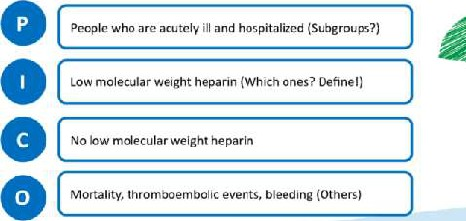 (元のファイル名: image40.jpg)
-  (元のファイル名: image41.jpg)
-  (元のファイル名: image42.jpg)
-  (元のファイル名: image43.jpg)
-  (元のファイル名: image44.jpg)
-  (元のファイル名: image45.jpg)
- 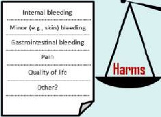 (元のファイル名: image46.jpg)
- 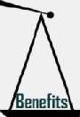 (元のファイル名: image47.jpg)
-  (元のファイル名: image48.jpg)
-  (元のファイル名: image49.jpg)
-  (元のファイル名: image50.jpg)
- 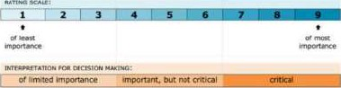 (元のファイル名: image51.jpg)
-  (元のファイル名: image52.jpg)
-  (元のファイル名: image53.jpg)
-  (元のファイル名: image54.jpg)
-  (元のファイル名: image55.jpg)
- 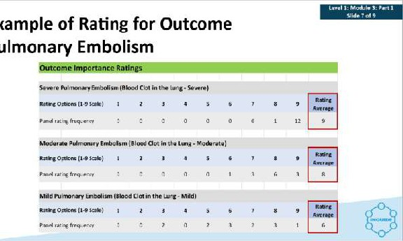 (元のファイル名: image56.jpg)
-  (元のファイル名: image57.jpeg)
-  (元のファイル名: image58.jpg)
-  (元のファイル名: image59.jpg)
- 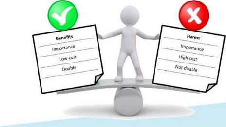 (元のファイル名: image60.jpg)
-  (元のファイル名: image61.jpg)
- 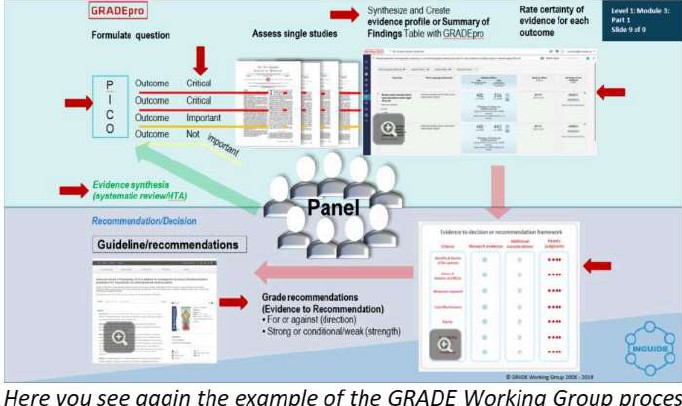 (元のファイル名: image62.jpeg)
-  (元のファイル名: image63.jpg)
-  (元のファイル名: image64.jpg)
-  (元のファイル名: image65.jpg)
-  (元のファイル名: image66.jpg)
-  (元のファイル名: image67.jpg)
- 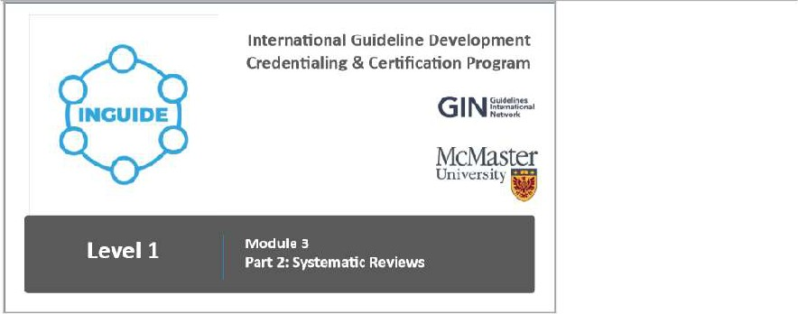 (元のファイル名: image68.jpeg)
-  (元のファイル名: image69.jpg)
-  (元のファイル名: image70.jpg)
-  (元のファイル名: image71.jpg)
-  (元のファイル名: image72.jpg)
-  (元のファイル名: image73.jpg)
-  (元のファイル名: image74.jpg)
-  (元のファイル名: image75.jpg)
-  (元のファイル名: image76.jpg)
- 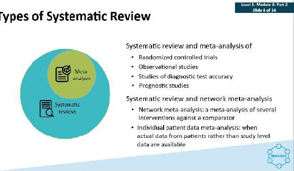 (元のファイル名: image77.jpg)
-  (元のファイル名: image78.jpg)
-  (元のファイル名: image79.jpg)
-  (元のファイル名: image80.jpg)
- 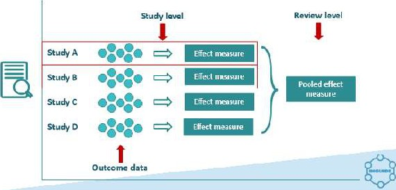 (元のファイル名: image81.jpg)
-  (元のファイル名: image82.jpg)
-  (元のファイル名: image83.jpg)
-  (元のファイル名: image84.jpg)
- 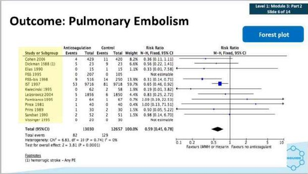 (元のファイル名: image85.jpg)
-  (元のファイル名: image86.jpeg)
-  (元のファイル名: image87.jpg)
-  (元のファイル名: image88.jpg)
-  (元のファイル名: image22.jpg)
- 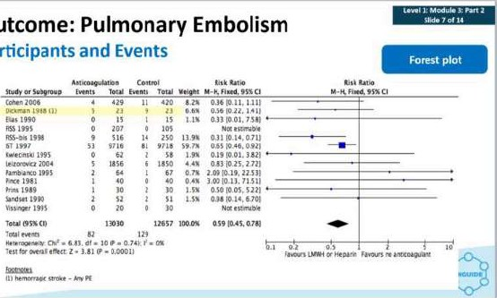 (元のファイル名: image90.jpeg)
-  (元のファイル名: image1.jpg)
-  (元のファイル名: image2.jpg)
-  (元のファイル名: image91.jpg)
- 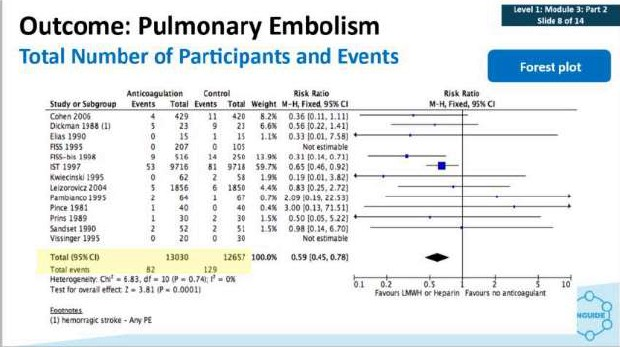 (元のファイル名: image92.jpg)
-  (元のファイル名: image93.jpg)
- 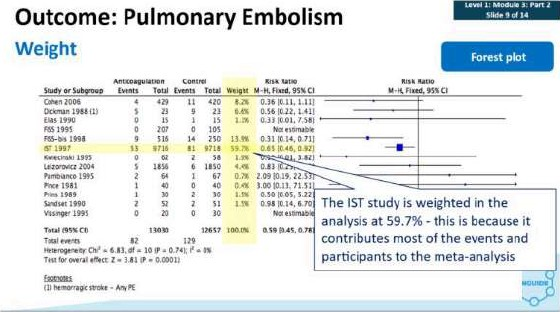 (元のファイル名: image94.jpg)
-  (元のファイル名: image95.jpg)
-  (元のファイル名: image96.jpg)
- 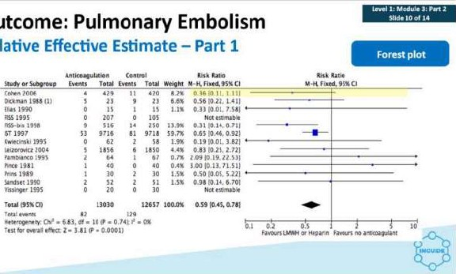 (元のファイル名: image97.jpeg)
-  (元のファイル名: image98.jpg)
- 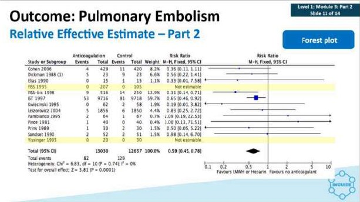 (元のファイル名: image99.jpg)
-  (元のファイル名: image100.jpeg)
-  (元のファイル名: image101.jpg)
- 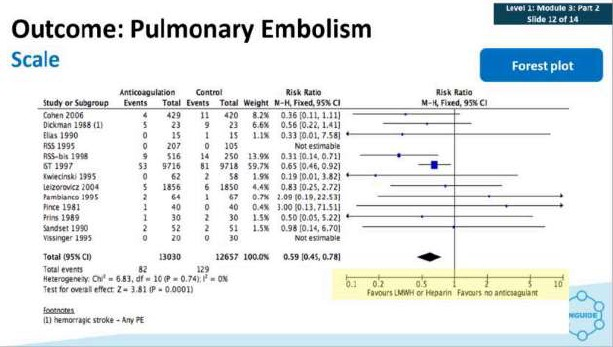 (元のファイル名: image102.jpg)
-  (元のファイル名: image103.jpg)
- 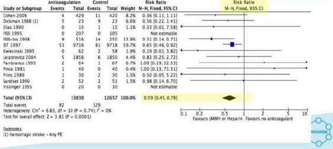 (元のファイル名: image104.jpg)
-  (元のファイル名: image105.jpg)
- 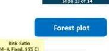 (元のファイル名: image106.jpg)
-  (元のファイル名: image107.jpg)
-  (元のファイル名: image108.jpg)
-  (元のファイル名: image109.jpg)
- 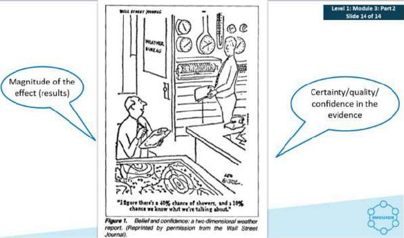 (元のファイル名: image110.jpg)
-  (元のファイル名: image111.jpg)
-  (元のファイル名: image112.jpg)
-  (元のファイル名: image113.jpg)
-  (元のファイル名: image114.jpg)
- 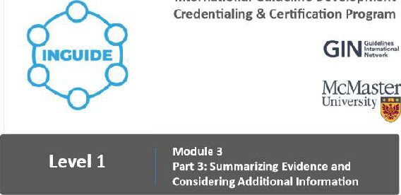 (元のファイル名: image115.jpeg)
- 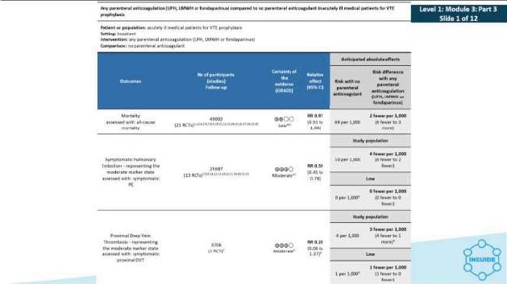 (元のファイル名: image116.jpg)
-  (元のファイル名: image117.jpg)
-  (元のファイル名: image118.jpg)
-  (元のファイル名: image119.jpg)
-  (元のファイル名: image120.jpg)
- 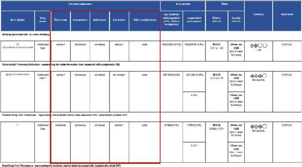 (元のファイル名: image121.jpg)
-  (元のファイル名: image122.jpg)
-  (元のファイル名: image123.jpg)
- 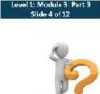 (元のファイル名: image124.jpg)
-  (元のファイル名: image125.jpg)
-  (元のファイル名: image126.jpg)
-  (元のファイル名: image127.jpg)
-  (元のファイル名: image128.jpg)
-  (元のファイル名: image129.jpg)
-  (元のファイル名: image130.jpg)
-  (元のファイル名: image131.jpg)
-  (元のファイル名: image132.jpg)
-  (元のファイル名: image133.jpg)
-  (元のファイル名: image134.jpg)
- 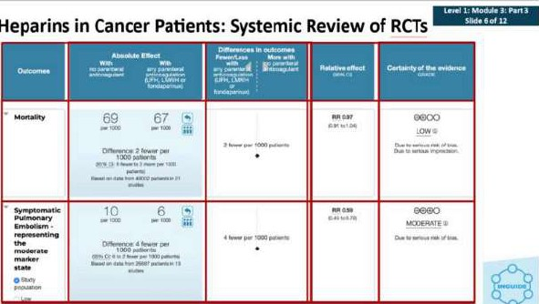 (元のファイル名: image135.jpg)
-  (元のファイル名: image136.jpg)
-  (元のファイル名: image137.jpg)
- 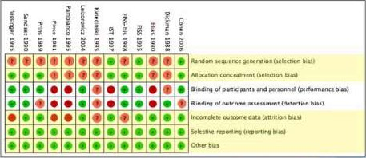 (元のファイル名: image138.jpg)
-  (元のファイル名: image139.jpg)
-  (元のファイル名: image3.jpg)
- 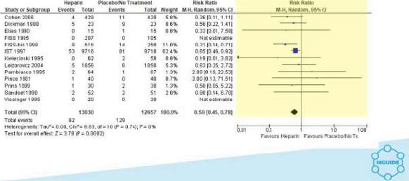 (元のファイル名: image141.jpg)
-  (元のファイル名: image142.jpg)
-  (元のファイル名: image143.jpg)
- 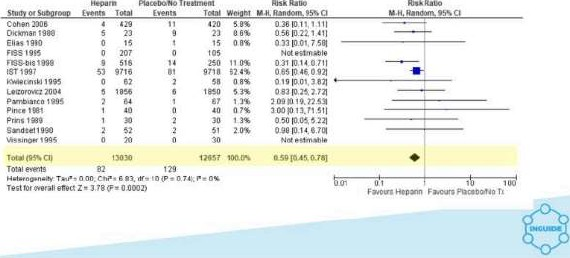 (元のファイル名: image144.jpg)
-  (元のファイル名: image145.jpg)
-  (元のファイル名: image146.jpg)
- 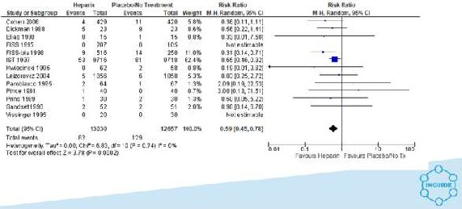 (元のファイル名: image147.jpg)
-  (元のファイル名: image148.jpg)
- 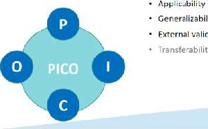 (元のファイル名: image149.jpg)
-  (元のファイル名: image150.jpeg)
-  (元のファイル名: image151.jpg)
- 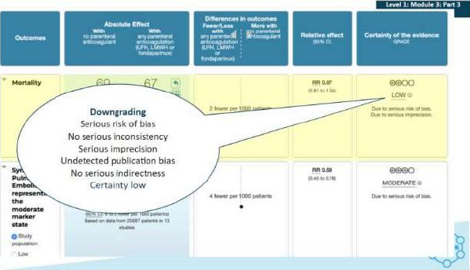 (元のファイル名: image152.jpg)
-  (元のファイル名: image153.jpg)
-  (元のファイル名: image154.jpg)
-  (元のファイル名: image4.jpg)
-  (元のファイル名: image5.jpg)
-  (元のファイル名: image6.jpg)
-  (元のファイル名: image7.jpeg)
-  (元のファイル名: image8.jpg)
-  (元のファイル名: image9.jpg)
-  (元のファイル名: image10.jpg)
-  (元のファイル名: image89.jpg)
-  (元のファイル名: image11.jpg)
-  (元のファイル名: image12.jpg)
-  (元のファイル名: image13.jpg)
-  (元のファイル名: image14.jpg)
-  (元のファイル名: image15.jpg)
-  (元のファイル名: image16.jpg)
-  (元のファイル名: image17.jpg)
-  (元のファイル名: image18.jpg)
-  (元のファイル名: image19.jpg)
-  (元のファイル名: image20.jpeg)
-  (元のファイル名: image21.jpg)
-  (元のファイル名: image23.jpg)
-  (元のファイル名: image24.jpeg)
-  (元のファイル名: image25.jpg)
- 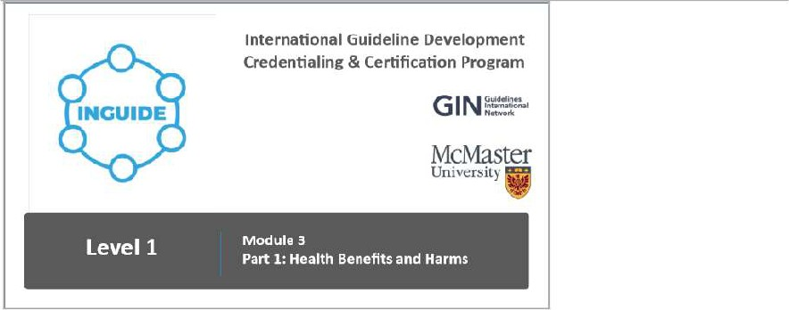 (元のファイル名: image26.jpg)
-  (元のファイル名: image27.jpeg)
-  (元のファイル名: image28.jpg)
-  (元のファイル名: image29.jpeg)
-  (元のファイル名: image30.jpg)
-  (元のファイル名: image31.jpg)
-  (元のファイル名: image32.jpg)
-  (元のファイル名: image33.jpg)
-  (元のファイル名: image34.jpg)
- 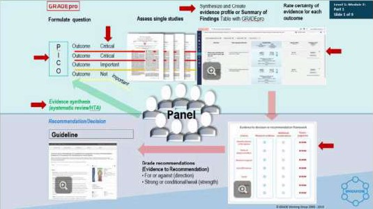 (元のファイル名: image35.jpg)
-  (元のファイル名: image36.jpg)
- 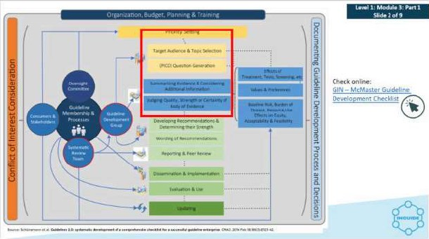 (元のファイル名: image37.jpg)
- 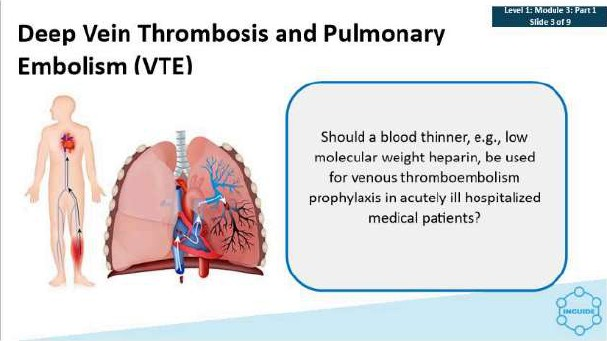 (元のファイル名: image38.jpg)
-  (元のファイル名: image140.jpg)
-  (元のファイル名: image348.jpg)
-  (元のファイル名: image349.jpg)
