# 抽出された文章

INGUIDE Level 1: Module 04

# CONTENTS

PART 1: DEVELOPING RECOMMENDATIONS....

Process for Developing Recommentations ................................................................................. 4

Recommendations Direction and Strenght— Criteria ............ .

Recommendations Criterial and Strength — Criteria Description .

Make Decisions About... ...........................„...................... 10

Conditional Recommendations................................................„............................................... 12

When is The Balance Not Clear? ............................................................. 15

Strong Recommendations 18

Implications of a strong recommendation........... .. 19

When is the Balance Clear? ...20

Interactive Evidence to Decision Frameworks ...... 21

Utilizing the Evidence to Decision Framework.................. 23

Example of Thromboembolism Prevention in Hospitalized Patients — Part 124

Example of Thromboembolism Prevention in Hospitalized Patients — Part 2 .. 25

Example of Thromboembolism Prevention in Hospitalized Patients— Part 2 .26

Example of Thromboembolism Prevention in Hospitalized Patients — Part 3 .. 28

Summary of 29

Balance of ...... 30

Options .....................................................„.................................................................... . . ..... 31

You Have Completed Part 1 ....... 32

PART 2: TYPES OF RECOMMENDATIONS................... .. . ....... 33

Voting vs Consensus34 Voting vs Consensus — Recommendation ........ 36 Reporting Recommendations.................................................................................................... 37

Strong Recommendation Based on Low or Very Low Certainty ............... 38 No Such Thing as 'No Recommendation' . 40 Wording of Recommendations ...... 41

Wording of Recommendations - Key Considerations . 43

When Could You Make a Good Practice Statement? ................................... 44 Two Examples of Good Practice Statements................ 46

You Have Completed Part 2 — 47 PART 3: REPORTING AND PEER REVIEW..................................................................................

The GIN — McMaster Checklist for Guideline Development ..................................................... 49 Reporting and Peer Review .............................„.............................. ....... ...... .............. . 50

Dissemination and Implementation .......................................................................................... 51

Dissemination and Implementation - Resources ...................................... ......... .............. . .. 53

Evaluation and Use ......................................................................... ......... 54

Updating ................................................................................... . 55 You Have Completed Part 3 — 56

# PART 1: DEVELOPING RECOMMENDATIONS

# PROCESS FOR DEVELOPING RECOMMENTATIONS

The process for developing recommendations starts with the guideline development group or panel developing the PICO question. Once the question is formulated, an evidence synthesis such as a systematic review or a health technology assessment is conducted, to synthesize the evidence for the critical and important outcomes. Outcomes that are not important will not be included in the evidence systhesis. The evidence review team will assess single studies, for the risk of bias and other factors synthesize the evidence and create evidence profile so, evidence to decision tables if they use the GRADE approach. They will rate the certainity of the evidence for each outcome and for other criteria on the evidence to decision frameworks which will be part of this module and explained in this module. They will provide a rating of the overall certainity of the evidence that is, for the guideline development group to review. The guideline development group, will then use Evidence to decision or evidence to recommendation frameworks to determine the GRADE of the recommendation that is, wheather or not a recommendation is strong or conditional and for which option; can be for a particular option or intervention, or against, which determines the direction. Once a recommendation is approved, it is published as o recommendation or in a guideline. Note that, this slide represents the typical GRADE approach some organisations will not use the GRADE approach but, the overall concepts will be similar.

DEVELOPING RECOMMENDATIONS AND DETERMINING THEIR DIRECTION

# AND STRENGHT — PART 1

Developing Recommendations and Determining their Direction and Strength — Part 1

TYPE

OF

RECOMMENDATION

strong recommendation azainst the intervention

Conditianöl recommendation a ainst the in erventior

recommendation for either the intervention or the comparison

Conditional recommendation for the interventior

recommen tion for the intervention

Net undesidarble consequences vs Net desirable consequences

TYPE OF RECOMMENDATION

Strong recommendation against the intervention

Conditional recommendation against the intervention

Conditional recommendation for either the intervention or the comparison

Conditional recommendation for the intervention

Strong recommendation for the intervention

The direction and strength of a recommendation is determined, by the balance of the undesirable and desirable consequences of an intervention. If there are net undesirable consequences, typically a recommendation against the intervention is made. If there are net desirable consequences, a recommendation in favour is made. However, the balance is not always clear. When it is clear strong recommendations eitherfor or against in intervention are

made. If the balance is not clear a conditional or also called weak recommendation for or against the intertvention is made. In rare circumstances, in particular when two active intervention is compared, a recommendation that is conditional for both interventions, or for the intervention and the comparator, may be made.

# RECOMMENDATIONS DIRECTION AND STRENGHT — CRITERIA

# Recommendations Direction and Strength - Criteria

A recommendation: a precise description of the best course of action for a specific situation

action

for

a

and

the

comparator

It

should

include

the

strength

of

the

recommendation

and

the

certainty

of

the

It should include a description Of the population, the intervention, and the comparator

underlying evidence

- Two main decisions required for formulating a recommendation based on the evidence:
- In which direction should the recommendation be made o How strong should the recommendation be
- Strong recommendation - all criteria point towards recommending the option o clear net health benefits, o unimportant differences in value, o inexpensive, o no equity, acceptability, feasibility concerns
- Conditional or weak recommendation - low confidence of recommended course of action leading to clear net consequences in the target population
The criteria that determine the direction and strength of a recommendation are described here. They include the problem or priority of the problem, the magnitude of the desirable health effects, the magnitude of the undesirable health effects, the certainity of the evidence which is overarching for the criteria, the underlying values, the balance of the effects, required resources, the certainity of the evidence about the required resources considerations on cost effectiveness, equity, acceptibility andfeasibility.

A recommendation should then be a precise description of the best course of action for a specific situation. It should include a description of the population, the intervention, and the comparator if that is not obvious, and who makes the recommendation.

It should also indicate the strength of the recommendation and the certainty of the underlying evidence. Thus, formulating a recommendation based on the evidence requires two main decisions:

- In which direction should the recommendation be made, i.e., for or against the intervention or the comparator? A rare scenario as already descriped is that the guideline panel believes that two options are equal.
- How strong should the recommendation be, should the treatmentfor instance, be used in all or most people, or are there important conditions that should be fulfilled in order to follow the recommendation ?
A strong recommendation is issued when all criteria point towards recommending the option. For example, there are clear net health benefits, it is unlikely that differences in values play a role, the option is not expensive, and there are no equity, acceptability, or feasibility concerns. A conditional recommendation or also called weak recommendation by some organizations, however, means that not all stars are aligned with regards to the confidence that the recommended course of action would lead to clear net consequences in the target population.

# RECOMMENDATIONS CRITERIAL AND STRENGTH — CRITERIA DESCRIPTION

Influences of the criteria on the direction and strength of a recommendation

- Problem The judgment about the problem is determined by the importance and frequency of the health care issue that is addressed (burden of disease, prevalence, cost or baseline risk). If the problem is of great importance a strong recommendation may be more likely.
- Values and preferences or the importance of outcomes -5 This describes how important health outcomes are to those affected, how variable they are, and if there is uncertainty about this.
- Certainty of the evidence about the health benefits and harm + The higher the certainty of the evidence, the more likely is a strong recommendation.
- Health benefits, harms and burden and their balance This requires an evaluation of the absolute effects of both the benefits and harms and their importance, including the judgment about values.The greater the net benefit or net harm, the more likely is a strong recommendation for or against the option.
- This requires an evaluation of the absolute effects of both the benefits and harms and their importance, including the judgment about values.
- The greater the net benefit or net harm, the more likely is a strong recommendation for or against the option.
- Resource implication This describes how resource intensive an option is, if it is cost-effective and if there is incremental benefit. The more advantageous or clearly disadvantageous these resource implications are, the more likely is a strong recommendation.
- Equity The greater the likelihood to reduce inequities or increase equity and the more accessible an option is, the more likely is a strong recommendation.
more likely is a strong recommendation.

g.Feasibility The greater the feasibility of an option to all or most stakeholders, the more likely is a strong recommendation.

7.

Acceptability

The

greater

the

acceptability

of

an

option

to

all

or

most

stakeholders,

the

Here is the description of the criteria and what conderations might lead to a strong or conditional recommendation. Please read how the criterion influences the direction and strength of a recommendation.

MAKE DECISIONS ABOUT...

Make Decisions About...

- Are the expected health benefits greater than the harms or vice versa?What is the magnitude of the resource requirements and costs related to the intervention and is it cost-effective?What is the impact of the intervention on equity? This includes societal implications and environmental impact.Is the intervention acceptable to different stakeholders?Is the intervention feasible?Organizations can call out specific criteria that may be relevant to a particular guideline or topic.
- Are the expected health benefits greater than the harms or vice versa?
- What is the magnitude of the resource requirements and costs related to the intervention and is it cost-effective?
- What is the impact of the intervention on equity? This includes societal implications and environmental impact.
- Is the intervention acceptable to different stakeholders?
- Is the intervention feasible?
- Organizations can call out specific criteria that may be relevant to a particular guideline or topic.
When making a recommendation, a guideline group will recommend or suggest an intervention or the alternative.

When making a recommendation one needs to consider evidence and make considerations or decisions about the extent of desirable and undesirable consequences of an intervention.

- Are the expected health benefits greater than the harms or vice versa?What is the magnitude of the resource requirements and costs related to the intervention and is it cost-effective?What is the impact of the intervention on equity? This includes societal implications and environmental impact.Is the intervention acceptable to different stakeholders?Is the intervention feasible?Organizations can call out specific criteria that may be relevant to a particular guideline or topic.
- Are the expected health benefits greater than the harms or vice versa?
- What is the magnitude of the resource requirements and costs related to the intervention and is it cost-effective?
- What is the impact of the intervention on equity? This includes societal implications and environmental impact.
- Is the intervention acceptable to different stakeholders?
- Is the intervention feasible?
- Organizations can call out specific criteria that may be relevant to a particular guideline or topic.
Reference: Alonso-Coello P, Schunemann H], Moberg J, Brignardello-Petersen R, Akl EA, Davoli M, et al. GRADE Evidence to Decision (EtD) frameworks: a systematic and transparent approach to making well informed healthcare choices. 1: Introduction. BMJ.

So, in summary, when making a recommendation, a guideline group will decide whether to recommend or suggest an intervention or the alternative. When making the recommendation, they consider evidence and make considerations or decisions about how large the actual desirable and undesirable consequences of an intervention are. For example:

- Are the expected health benefits greater than the harms or vice versa? (This integrates considerations about the priority and severity of the problem, intervention effects, the values people place on the outcomes as well as the certainty in the effects.)What is the magnitude of the resource requirements and associated cost related to the intervention and is it cost-effective?What is the impact of the intervention on equity, perhaps including societal implications and environmental impact?Is the intervention acceptable to different stakeholders? This criterion includes ethical, human rights and other considerations.Is the intervention feasible? This criterion includes health system, social, legal, political and other considerations.Organizations can, of course, call out specific criteria that may be relevant to a particular guideline or topic.
- Are the expected health benefits greater than the harms or vice versa? (This integrates considerations about the priority and severity of the problem, intervention effects, the values people place on the outcomes as well as the certainty in the effects.)
- What is the magnitude of the resource requirements and associated cost related to the intervention and is it cost-effective?
- What is the impact of the intervention on equity, perhaps including societal implications and environmental impact?
- Is the intervention acceptable to different stakeholders? This criterion includes ethical, human rights and other considerations.
- Is the intervention feasible? This criterion includes health system, social, legal, political and other considerations.
- Organizations can, of course, call out specific criteria that may be relevant to a particular guideline or topic.
# CONDITIONAL RECOMMENDATIONS

Most Recommendations

"Conditional" upon individual circumstances

Conditional recommendation often requires considerable support with implementation

Condition should be described

Most recommendations however, are conditional recommendations they are similar to a yellow traffic light at an intersection. They are conditional upon individual circumstances one might consider, whether or not to implement the action pass or not implement the intervention not pass. It often requires considerable support with implementation when a conditional recommendation is offered and the condition should be described.

IMPLICATIONS OF A CONDITIONAL OR

WEAK RECOMMENDATION

Patients: The majority of people in this situation would want the recommended course of action, but many would not

Clinicians: Different choices will be appropriate for individual patients, and clinicians must help each patient arrive at a management decision consistent with the patient's values and preferences. Decision aids may be useful in helping individuals to make decisions consistent with their individual risks, values, and preferences.

Policy makers: Policy making will require substantial debate and involvement of various stakeholders. Performance measures about the suggested course of action should focus on whether an appropriate decision-making process is duly documented.

Researchers: The recommendation is likely to be strengthened by additional research. An evaluation of the conditions and criteria that determined the conditional recommendation will help to identify possible research gap.

It is thus important, to understand the implications of a conditional or weak recommendation. For patients or people with a condition that means that the majority of people in this situation would want the recommended course of action, but many would not. For clinicians and health practioners it means, that different choices will be appropriate for individual patients, and clinicians must help each patient or person to arrive at a management decision consistent with the patient's values and preferences. Decision aids may be useful in helping individuals to make decisions consistent with their individual risks, values, and preferences. For policy makers it means, that policy making will requires substantial debate and involvement of various stakeholders. Performance measures about the suggested course of action should focus on whether an appropriate decision-making process is duly documented. For researchers it means, the recommendation is likely to be strengthenedfor future updates or adaptation by additional research. An evaluation of the conditions and criteria and the related judgments, research evidence, and additional considerations that determined the conditional rather than strong recommendation will help to identify possible research gap.

WHEN IS THE BALANCE NOT CLEAR?

When is The Balance Not Clear?

Something prevents us from being sure that implementing this recommendation is good for everyone

Something prevents us from being sure that implementing this recommendation is good for everyone

Net consequences unclear because research evidence for criteria on the EtD are not conclusive

(low or very low certainty or too different effect for specific populations)

Effects very closely balanced-magnitude of benefits are similar to harms People value the outcomes differently and a recommendation applying to all is not appropriate

Cost differ by jurisdiction.Costs too high in some jurisdictions or not currently affordable Intervention or consequences are not equitable, acceptable to all or not feasible (e.g., cultural, legal reasons)

So, when is the balance not clear between the desirable and undesirable consequences? It is when something prevents us from being sure that implementing this recommendation is good for everyone. For instance, the net consequences are unclear because research evidence for criteria on the evidence to decision framework are not conclusive, for instance, when there is low or very low certainty or effects too different for specific populations that cannot be more specifically defined. In other words, the effects may be very closely balanced, the magnitude of benefits may be similar to harms. People valuing the outcomes differently and a recommendation applying to all is not appropriate is another reason for when the balance is not clear. When cost differ by jurisdiction and are too high in some jurisdiction or not affordable at a present time perhaps, or when interventions or consequences are not equitable, acceptable to all or notfeasible, for instance, for culture or legal reasons.

## CONDITIONAL RECOMMENDATIONS

# Conditional Recommendations

Let us take this example, from the World Health Organization guideline on tuberculosis. This is from the eTB guidelines recommendation map and easily accessible guideline resource that WHO has produced. The recommendation reads: "Chest radiography may be offered to people living with HIV on antiretroviral therapy and preventive treatment be given to those with no abnormal radiographic findings." This is a conditional recommendation based on low certainity of the evidence.

CONDITIONAL RECOMMENDATIONS - EXAMPLES

## Conditional Recommendations - Examples

People value the outcomes differently and a recommendation applying to all is not appropriate

Costs differ by jurisdiction and are too high in some jurisdiction or are not currently affordable

Intervention or consequences not equitable, acceptable to all or not feasible

(cultural, legal reasons)

fit

Values: Addition Of

Large cost: More resources

Varies significantly.

abnormal chest

required, particularly if chest

mainly by seffng,

radiography increases

radiography is not available.

health system

burden on patients.

Chest radiography would

infrastructure and

Patients may value

increase the number Of HIV

workload in HIV clini

greater certainty in

positive people who undergo

excluding TB disease

fu rther investigations for TB

People valuing the outcomes differently and a recommendation applying to all is not appropriate

Values: Addition of abnormal chest radiography increases burden on patients. Patients may value greater certainty in excluding TB disease

Costs differ by jurisdiction and are too high in some jurisdiction or are not currently affordable

Large cost: More resources required, particularly if chest radiography is not available. Chest radiography would increase the number of HIV positive people who undergo further investigations for TB

Intervention or consequences not equitable, acceptable to all or not feasible (cultural, legal reasons)

Varies significantly, mainly by setting, health system infrastructure and workload of HIV clinics.

Here is some examples for why a conditional recommendation was made. Addition of abnormal chest radiography increases the burden on patients. Patients may value greater certainty in excluding TB disease however, and some may do that more than others. There are large cost associated with that intervention. More resources are required, particularly if chest radiography is not already available. It would also increase the number of HIV positive people who undergo further investigations for TB (or tuberculosis). Further more, acceptability and feasibility may vary significantly, by setting the health system infrastructure, and socially workload for those working in HIV clinics.

# STRONG RECOMMENDATIONS

## Strong Recommendations

World

Health

(8)

Here is an example of a strong recommendation, also from the WHO tuberculosis guideline recommendation map. The recommendation reads antiretroviral therapy should be started in all tuberculosis patients living with HIV regardless of their CD4 cell count. The CD4 cell count refers to a certain level of immunity and people living with HIV. The recommendation is strong based on high certainty of evidence.

# IMPLICATIONS OF A STRONG RECOMMENDATION

# Implications of a Strong Recommendation

patients: Most people in this situation sqentthe recommended course Of action ane only a small proportion would not.

Clinicians: Most individuals shoulé follow the recommended course of action. Formal decision aids ire not likely to be needed to help individual patients make decisions consistent witi their values and preferences.

policy makers: The 	cen be adopted as policy in most situations. Adherence to this recommendation according to the guideline could be used as a quality criterion or performance itx'icator,

Researchers: The recommendation is supported by credible research or Other convincirW judgments that make additional research unlikely to alter the recommendation. On Occasion, a strong recommendation is based on IOW or very IOW certainty in the evidence.

Patients: Most people in this situation would want the recommended course of action and only a small proportion would not

Clinicians: Most individuals should follow the recommended course of action. Formal decision aids are not likely to be needed to help individual patients make decisions consistent with their values and preferences.

Policy makers: The recommendation can be adopted as policy in most situations. Adherence to this recommendation according to the guideline could be used as a quality criterion or performance indicator

Researchers: The recommendation is supported by credible research or other convincing judgments that make additional research unlikely to alter the recommendation. On occasion, a strong recommendation is based on low or very low certainty in the evidence.

Also here, it is important to understand the implications of a strong recommendation. For patients or people with a condition that means most people in this situation would want the recommended course of action and only a small proportion would not. For clinicians and health proffesionals it means that most individuals should follow the recommended course of action. Formal decision aids are not likely to be needed to help individual patients make decisions consistent with their values and preferences. For policy makers it means, the recommendation can be adopted as policy in most situations. Adherence to this recommendation according to the guideline could be used as a quality criterion or performance indicator. For researchers it means, the recommendation is supported by credible research or other convincing judgments that make additional research unlikely to alter the recommendation. On occasion, a strong recommendation is based on low or very low certainty in the evidence. In such instances, further research may provide important information that alters the recommendation.

WHEN IS THE BALANCE CLEAR?

When is The Balance Clear?

Applies to nearly all patients: for or against an option

Applies to nearly all patients: for or against an option

Net consequences evident because research evidence for criteria on the EtD is conclusive (moderate or high certainty)

Effects clear — magnitude of benefits either much greater or much smaller than harms

People valuing the outcomes similarly, and recommendation applying to all is appropriate

Costs are not prohibitive across settings

Intervention or consequences are equitable, acceptable to all, and feasible cultural, legal reasons)

So, when is the balance of the consequence clear, again, when it applies to nearly all patients and the balance can be clear in the sense, that the recommendation for or against an option is made. For instance, when the net consequences are evident because research evidence for critera on the Evidence to Decision Framework is conclusive, that is, when there is moderate or high certainty. When the effects are clear, the magnitude of benefits either much greater or much smaller than the harms. When people value the outcome similarly and a recommendation applying to all is appropriate. When cost are not prohibitive across settings. And when the intervention or consequences are equitable, acceptable to all and feasible for instance, culturally andfor legal reasons.

# INTERACTIVE EVIDENCE TO DECISION FRAMEWORKS

The frameworks:

- Lay out the required details about the question
- Lay out the evidence that is assessed according to specific criteria and summarized in HTA (Health Technology Assessments) and systematic reviews
- Describe the type of conclusions that follow (including implementation, research)
- Support the conduct of these processes and development of user tools
Question

- Details — PICO Subgroups
- Background and conflicts of interest
Assessment

- Criteria
- Judgments
- Research evidence (HTA and Systematic Reviews)
- Additional considerations
Conclusions

- Type of decision - recommendation
- Justification
- Implementation considerations
- Monitoring and evaluation
- Research priorities
Presentation

- Guideline group meetings & informing coverage decisions
- Database of decision frameworks
- Interactive Decision Aids (iDeAs), apps
The GRADE Working Group, over the last two decades, has developed structured frameworks to make these decisions transparent and reduce bias in related processes- Again, we call these frameworks Evidence to Decision Frameworks. The frameworks lay out the required details about the question, the evidence that is assessed according to specific criteria and summarized in health technology assessments or systematic reviews, and then describe the type of conclusions thatfollow including how to implement and what to watch outfor during implementation, including the research that must be done. Finally, they support the conduct of these processes and development of user tools such as interactive decision aids.

Evidence to decision frameworks relate to how we arrived at the actual recommendation. It starts with a question, a topic which we've addressed in quite some detail before.

We also talked about conflicts of interest that may be relevant, that may dictate whether or not you can participate in the formulation of the recommendation. Then, the evidence to decision framework goes into an assessment of the evidence that is provided, based on specific criteria which guide ourjudgments about that research evidence as described before. As was already mentioned also, potential additional considerations that are or may be relevant are part of the conclusion.

The conclusions include the guideline panel's recommendation, and they should provide justifications for why they make a recommendation, as demonstrated on the previous slide. As o guideline panel we are often in the best situation to also think about implementation of the recommendations and how to monitor and evaluate the recommendations. A panel meeting is also a good opportunity to develop future research priorities, as, inevitably, a guideline panel will detect gaps in the evidence.

And finally, there are opportunities through these Evidence to Decision frameworks to lead the panel to formulate recommendations that can be stored in databases such as the one, shown to you on the previous slide and provide implementation tools such as decision aids.

UTILIZING

THE

EVIDENCE

TO

DECISION

FRAMEWORK

The Evidence to Decision frameworks provide a structured approach to arriving at a recommendation.

In the early days of guideline development, guideline panels often did not arrive at a conclusion because there was a lack of structure that one could follow to make sure that all important issues were addressed.

This example of an evidence to decision framework is from the European Breast Guidelines, an initiative of the European Commission. The way it works is that the research evidence is compiled and synthesized by the evidence review team, and then discussed with the panel.

As a guideline panel is looking at the evidence, any unique insights that a guideline panel member may have can be added under additional considerations before a judgment on a specific criterion is made. Thus, guidelines and recommendations are always based on judgment. For example, a judgment could be about how large the health benefits of the interventions are, or about other desirable consequences of an intervention. The judgment in this case may have been that there is a small health benefit from breast cancer screening in women of a certain age. These judgments are typically made by those panel members without conflicts of interest. The guideline panel may make judgments on the basis of a simple consensus process or a more formal, structured process to find agreement. The organization responsible for the guideline will determine the specific processes used to arrive at agreement, which may include voting.

# EXAMPLE OF THROMBOEMBOLISM PREVENTION IN HOSPITALIZED PATIENTS — PART 1

## Example of Thromboembolism Prevention in Hospitalized Patients — Part 1

Select each box to reveal the information

Problem

Is the problem a Priority?

Desirable Effects

HOW subslalltial are the desirable antc:patpd pff?cts?

U ndesirable Effects How substantial are the undesirable anticipated effects?

Certainty of Evidence

What is the certa.nty ot the of affects?

Select each box to reveal the information

- Problem — is the problem a Priority?
- Disicrable Effects — how substaintial are the desirable anticipated effects?
- Undesirable Effects — how substantial are the undesirable anticipated effects?
- Certainty of Evidence —what is the overall certainty of the evidence of effects?
Returning to our example of thromboembolism prevention in hospitalized patients, the guideline panel judged the problem to be a priority. They also, after reviewing the evidence, made a judgment that the desirable health effects are small for the intervention, which was administration of low molecular weight heparin.

When evaluating the undesirable health effects they also judged that they are small.

The panel then reviewed the certainty of the evidence. Across all outcomes, their overall judgment was low certainty, based on the lowest certainty for any of the critical outcomes.

# EXAMPLE OF THROMBOEMBOLISM PREVENTION IN HOSPITALIZED PATIENTS — PART 2

Example of Thromboembolism Prevention	in Hospitalized Patients — Part 2

Next, the panel reviewed the evidence about the values patients place on the outcomes and judged that there was no important variability or uncertainty. That is, they felt most patients would judge these outcomes as critical and they were certain about that.

# EXAMPLE OF THROMBOEMBOLISM PREVENTION IN HOSPITALIZED

## PATIENTS — PART 2

Example of Thromboembolism Prevention in

Hospitalized Patients — Part 2

health effects

Unesirable health effects

Desirable health effects

- Importance of the problem
- Desirable and undesirable effects
- Values
- Certainty of evidence
The panel judge the desirable health effects to be larger than the undesirable health effects

Panel typically make judgment that provide a clear balance

Large desirable health effects and small undesirable health effects provides an easier path to determine balance

The panel then judges the balance of the desirable and undesirable health effects by considering the importance of the problem, the desirable and undesirable effects, the values, and the certainty of the evidence In this case, after carefully balancing these criteria, the panel judged the desirable health effects to be probably larger than the undesirable health effects. This situation presents a particular teaching point. Although not common, when desirable and undesirable health effects are similar, a panel still should try to decide whether or not the balance favours one option or the other. In this case, despite a judgment that the desirable and undesirable effects were small, the panel felt that there were still more desirable than undesirable effects on balance. They should make it transparent. In other scenarios the panel typically makes judgments that provide a clearer balance. For instance, large desirable health effects, and small undesirable health effects, and that provides an easier path to determine the balance.

# EXAMPLE OF THROMBOEMBOLISM PREVENTION IN HOSPITALIZED PATIENTS — PART 3

Although not shown here on the slide, for resources, the panelfelt that required resources were negligible. But there were no included studies and it was made clear that this was a judgment based on no included studies.

The panel based theirjudgment about cost-effectiveness on three studies that suggested that the use of low molecular weight heparin is cost-effective.

Also not shown here, no research evidence was identified for equity and that was also made

transparent. But after deliberation and adding these considerations, the panel judged that there was probably no impact on equity. Saying that no research evidence was used enhances transparency.

A detailed description of the evidence about acceptability and feasibility was provided and the panel, after consideration of that evidence, judged that the intervention was both acceptable andfeasible as shown here.

## SUMMARY OF JUDGMENTS

### Summary of Judgments

At the end of the process these judgments on the individual criteria provide guidance for whether a recommendation should be developed in favor of the intervention or against the intervention, that is, in favor of the comparator. You see here, the Summary of Judgments that most criteria suggest that overall, the desirable consequences probably outweigh the undesirable consequences.

BALANCE

OF

CONSEQUENCES

Desirable consequences benefits, acceptability

Undesirable consequences + harms, resources, inequitable

It is important to emphasize that the recommendation is determined by the balance of the desirable consequences and undesirable consequences that go beyond the health benefits and harms and health effects are therefore also distinguished in terms of terminologyfrom the more general term consequences.

Conditional

for

an

intervention

OPTIONS

•

Strong

against

an

intervention

•	Conditional against an intervention

According to the GRADE approach, again one example for our course, the most frequently used approach to formulating recommendations, there are four options to make a recommendation. The first option is to make a strong recommendation for an intervention, again, if all stars are aligned in terms of the consequences. That is, if there are clearly more desirable than undesirable consequences, if there is high or moderate certainty of the evidence of health effects, and if other criteria point in the right direction.

A conditional recommendation for the intervention is made ifthe desirable consequences do not clearly outweigh the undesirable consequences, the certainty of the evidence is not as good such as it is, low or very low or if there is large cost or a lot of variability with regards to values and preferences.

The same two options ofstrong and conditional recommendations exist when making a recommendation against the intervention, that is, in favour of the comparator. A strong recommendation against the intervention is made if there are clearly more undesirable consequences than desirable consequences, and a conditional recommendation against the intervention is made when this is less clear.

Other organizations may use different terminology or additional gradations but the principles are typically the same as presented here for the GRADE approach.

## YOU HAVE COMPLETED PART 1

You have completed Part 1!

Part 2 will describe parts of recommendations.

You have completed Part 1!

Part 2 will describe types of recommendations.

PART

2:

TYPES

OF

RECOMMENDATIONS

## VOTING VS CONSENSUS

### Voting vs Consensus

- To draw conclusion & generate recommendaton the panel needs to reach consensus
- Consensus is required regardless Of the certainty Of the evidence
- Can take place for judgments on criteria and conclusions (i.e., recommendations)
- For judgments about criteria on the Evidence to Decision (EtD)
- Ask for judgments on a criterion, suggestion by one member
(unless clear— e.g., how severe is the problem)

- Ask for disagreement
- If no consensus, can vote — simple majority rules for criteria of EtD
- To draw conclusion & generate recommendation the panel needs to reach consensus
- Consensus is required regardless of the certainty of the evidence
- Can take place for judgments on criteria and conclusions
(i.e., recommendations)

For judgments about criteria on the Evidence to Decision (EtD)

- Ask for judgments on a criterion, suggestion by one member
(unless clear — e.g., how severe is the problem)

- Ask for disagreement
- If no consensus, can vote — simple majority rules for criteria of EtD
To draw conclusions and generate a recommendation, the panel needs to reach consensus. Consensus is needed regardless if the evidence is of high certainty or of low certainty or very low certainty, and if the recommendation is clear or requires much debate. However, before a final recommendation is issued, there are many layers ofjudgment required as we already discussed. This includes the Evidence to Decision criteria. If a panel consensus cannot be achieved by discussion, a formal voting process can be used, possibly an anonymous one. The rules for reaching consensus and for voting need to be specified before the guideline development process starts and by the responsible organization.

# VOTING VS CONSENSUS - ETD CRITERIA

## Voting vs Consensus — EtD Criteria

- For individual EtD c?iteria:
- Ask for suggestion by memberor make a suggestion
- Ask for disagreement
- If there'S disagreement—a vctewith simple majorit'/ 	can be considered to make a judgment
For individual EtD criteria:

- Ask for suggestion by one member or make a suggestion 	Ask for disagreement
- If there's disagreement— a vote with simple majority (>50%) can be considered to make a judgment
Depending on the importance of the judgment, different rules can be used to achieve agreement, informally or by voting. In the GRADE approach, a common approach is to ask panel members to suggest ajudgment for individual Evidence to Decision criteria, and the chair of the panel may ask for disagreement by other panel members. If there is disagreement with the suggestion after debate, a vote with a simple majority, that is more than 50%, can be considered to make a judgment for an individual criterion.

# VOTING VS CONSENSUS - RECOMMENDATION

Voting vs Consensus — Recommendation

Samc prcccss of suggesting conclusion and seeking aglccmcrt or disagrccmcnt can be Llsed to determine the directon and strength ct tae recommendaticn

If direction is clear. co chairs and ch..irs initially suggest that the recommendation is for or against the intcrvcntion (the strengt will nccd tobe dctcrmincd) When considcring issuing a strong recommendation maioritv ofthc '"Ilel tas agree

W- process may differ By Organization: S)nnc Lisa voting. somc not o Emc use dittercnt m aorltv principles c SJtne use rut Inal consensus process, 	don't or 	"hit:h

1: Module a: 2

- Same process of suggesting a conclusion and seeking agreement or disagreement can be used to determine the direction and strength of the recommendation
- If direction is clear, co-chairs and chairs initially suggest that the recommendation is for or against the intervention (the strength will need to be determined)
- When considering issuing a strong recommendation majority of the panel has to agree.
- Process may differ by organization: o Some use voting, some not o Some use different majority principles o Some use formal consensus process, others don't
- Importance of transparency about which approach was used
The same process of suggesting a conclusion and seeking agreement or disagreement can be used to determine the direction and strength of the recommendation. Typically, the direction is determinedfirst. Chairs or co-chairs may initially suggest that the recommendation is for or against the intervention if the direction is clear, but the strength will need to be determined, still. When considering issuing a strong recommendation, which has important implications for practice as we described before, typically a large majority of the panel (such as 80 or 90%) needs to agree with a strong recommendation. Again, this process may differ by organization. Some use voting, others do not. Some use different majority principles. Some use veryformal consensus processes, and others do not. It is important to be transparent about which approach was used.

# REPORTING RECOMMENDATIONS

In

the 	"FR. LMWH. 	no

anticoagulmt (condtionat recommendation, Low certainty in the evidence effects). Among these anticoagulants. the panel suggests using LMWF (IOW certainty in evidence Of effects] or fondaparinux (very law certainty in the evidence of effects) rather than uFH (cmditional recommendation).

Remark: These 3 recomrnendations also apply to anticoagulant choices when VTE prophylaxis is considered for patients with stroke.

## Reporting Recommendations

The process offinding agreement, again, differs by guideline panel, but it is important to say that consensus is nearly always necessary.

In our example, the panel made a conditional recommendation that suggested using an anticoagulant in acutely ill medical patients.

The recommendation was grouped, for simplicity, with similar recommendations to enhance readability and understanding of context.

Given that the evidence also included patients with strokes, a subgroup for which there was concern about the potential undesirable health effects, it was remarked specifically that the recommendation applies also to that subgroup.

## STRONG RECOMMENDATION BASED ON Low OR VERY Low CERTAINTY

### Strong Recommendation Based on Low or Very Low Certainty

Low certairty evidence sugeests benefit in a life-threatenina situation

Low

or

very

low

certaint/

The certainty in evidence regarding harms can be low or high

Low certainty evidence suggests benefit

High certainty evidence suggests harm or e very high cost

LOW certainty evidence suggests equivalence Of 	alterna6ves

High certainty evidence suggests less harm for one cf the competing alternatives

High certainty evidence suggests equivalence of two alternatives

LOW certainty evidence S'_jggests harm in oneaf the alternatives

High Certainly evidence Suggests modes'. LeneIiL

- Low certainty evidence suggests benefit in a life-threatening situation
The certainty in evidence regarding harms can be low or high

- Low certainty evidence suggests benefit
High certainty evidence suggests harm or a very high cost

- Low certainty evidence suggests equivalence of two alternatives High-certainty evidence suggests less harm for one of the competing alternatives
- High certainty evidence suggests equivalence of two alternatives
Low-certainty evidence suggests harm in one of the alternatives

- High certainty evidence suggests modest benefits
Low or very low certainty evidence suggests a possibility of catastrophic harm

Reference: Neumann l, Santesso N, Akl EA, Rind DM, Vandvik PO, Alonso-Coello P, et al. A guide for health professionals to interpret and use recommendations in guidelines developed with the GRADE approach. J Clin Epidemiol.

Typically, strong recommendations will be based on at least moderate certainty of the evidence for the critical outcome.

However, there are some situations where only low or very low certainty of the evidence is available, but a strong recommendation may be warranted:

- When low certainty evidence suggests benefit in a life-threatening situation, whereby the certainty in evidence regarding harms can be low or high.
- When low certainty evidence suggests benefit and high-certainty evidence suggests harm or a very high cost.
- When low certainty evidence suggests equivalence of two alternatives, but highcertainty evidence suggests less harm for one of the competing alternatives.
- When high certainty evidence suggests equivalence of two alternatives and lowcertainty evidence suggests harm in one of the alternatives.
5. When high certainty evidence suggests modest benefits and low or very low-certainty evidence suggests a possibility for catastrophic harm.

# No SUCH THING AS 'No RECOMMENDATION'

## No Such Thing as 'No Recommendation'

- Purpose is to give guidance to clinicians
- The panel is best equipped to make a recommendation
- Single practitioner will not be able to review all the evidence
- Purpose is to give guidance to clinicians
- The panel is best equipped to make a recommendation
- Single practitioner will not be able to review all the evidence
Reference Neumann l, Alonso-Coello P, Vandvik PO, Agoritsas T, Mas G, Akl EA, et al. Do clinicians want recommendations? A multicenter study comparing evidence summaries with and without GRADE recommendations. J Clin Epidemiol. 2018;99:33-40.

Most guideline developers believe that the purpose of the guideline panel is to make a recommendation, whether the evidence is conclusive or not. That is because the guideline panel will be better equipped to make a recommendation and suggest a course of action than a single practitioner who is looking for guidance and will not be able to review all the evidence even if that evidence is sparse.

# WORDING OF RECOMMENDATIONS

Wording of Recommendations

Structured Wording and Specificity

o

molecular weight heparin reduces thromboembolism When compared with placebo

This is not a recommendation but a statement of fact. An actionable statement should be used

We suggest practitioners consider use of low molecular weight heparin

Considering does not suggest •what to do', in fact, by the nature of its mentioning an intervention is considered — direction and strengths should be indicated

o

We prefer using X over Y

This statement is missing an action

Standard practice is to use IOW molecular weight heparin in hospitalized patients

A recommendation is not made to describe standard practice but whether Or not an intervention might be best for the circumstances. There is also no exact description of the type of population

Structured wording and specificity

Low molecular weight heparin reduces thromboembolism when compared with placebo -5 This is not a recommendation but a statement of fact. An actionable statement should be used.

- We suggest practitioners consider use of low molecular weight heparin Considering does not suggest 'what to do', in fact, by the nature of its mentioning an intervention is considered — direction and strength should be indicated
- We prefer using X over Y This statement is missing an action
- Standard practice is to use low molecular weight heparin in hospitalized patients A recommendation is not made to describe standard practice but whether or not an intervention might be best for the circumstances. There is also no exact description of the type of population
The main aim of a guideline panel should be to generate recommendations that are specific, actionable, and understandable forthe target audience. To achieve this, structured wording should be used, and a style guide can help with this. This will optimize the implementation of the recommendations. We will illustrate the importance of using proper structured wording by providing four examples of non-actionable statements:

- Low molecular weight heparin reduces thromboembolism when compared with placebo — this is not a recommendation but a statement offact. An actionable statement should be used which is not included here.
- We suggest practitioners consider use of low molecular weight heparin. Considering does not suggest what to do, in fact by the nature of its mentioning an intervention is considered. Here, direction and strengths should be indicated.
- We prefer using X over Y — this statement is missing an action.
- Standard practice is to use low molecular weight heparin in hospitalized patient. A recommendation is not made to describe standard practice, but whether or not an intervention might be best for the circumstances. There also is no exact description of what the type of population, for instance, acutely or critically ill patient is.
Thus, all of these statements are inappropriate. Because, they are not clearly actionable.

# WORDING OF RECOMMENDATIONS - KEY CONSIDERATIONS

Wording of Recommendations - Key Considerations

The recommendation should describe: Recommendation can include remarks e Who is making rezommendation • They support the interpretation of

The recommendation should describe:

- Who is making recommendation
- Population
- Intervention
- Strength of recommendation
- Certainty of evidence
Recommendation can include remarks

- They support the interpretation of PICO subdomains and/or the conditions of recommendation
Reference: Lotfi T, Hajizadeh A, Moja L, Akl EA, Piggott T, Kredo T, et al. A taxonomy and framework for identifying and developing actionable statements in guidelines suggests avoiding informal recommendations. J Clin Epidemiol. 2022;141:161-71.

So, what should be done to produce actionable statement. The recommendation should describe:

- Who is making the recommendation
- The population with the necessary specificity
- The intervention and comparator if not obvious with required details
- The strength of the recommendation
- The certainty of the underlying evidence
A recommendation can also include remarks that are defined as follows:

A remark supports the interpretation of either the PICO subdomains for instance, population characteristics and/or the conditions framing one or more specific recommendation.

WHEN COULD You MAKE A GOOD PRACTICE STATEMENT?

When Could You Make a Good Practice Statement?

The message the panel needs to give: clear from the outset

- Good Practice StatementBased on clear and explicit criteria
- Good Practice Statement
- Based on clear and explicit criteria
- Is the message clear and actionable?
- The message needs to be necessary to actual health practice
- Implementing the good practice statement will result in large net positive consequences
- Collecting and summarizing the evidence is a poor use of guideline panel's time and energy
- There is a well-documented rationale connecting the indirect evidence
Reference: Dewidar O, Lotfi T, Langendam MW, Parmelli E, Saz Parkinson Z, Solo K, et al. Good or best practice statements: proposal for the operationalisation and implementation of GRADE guidance. BMJ Evid Based Med. 2022.

For some PICO questions, guideline panels offer a Good Practice Statement. This is when a full structured assessment of the evidence may be a poor use of the panel's time and energy because the message that the panel needs to give is clearfrom the outset.

In such cases a Good Practice Statement may be provided, which should be clearly distinguished from an official recommendation and be based on clear and explicit criteria. The organization for the guideline should determine if Good Practice Statements should be provided. And they should be used rarely. There are five conditions for issuing a good practice statement that should be followed:

- Is the message clear and actionable?
- The message needs to be necessary in regard to actual health practice.
- After consideration of all relevant outcomes and potential downstream consequences, implementing the Good Practice Statement will result in large net positive consequences-
- Collecting and summarizing the evidences is a poor use of a guideline panel's limited time and energy (in other words the opportunity cost is large).
- There is a well-documented clear and explicit rationale connecting the indirect evidence supporting the Good Practice Statement.
# Two EXAMPLES OF GOOD PRACTICE STATEMENTS

# Two Examples of Good Practice Statements

Box 2 Examples or potential presentations or good practice statement

Good practice statements

The panel believes that patients presenting With heart failure. initial assessment Of the patient's ability to

POrfOrrn 	Of dailv living represents good practice.

'n patients presenting with heart failure, clinicians should make on initial assessment o' the patient's •bility to perform routine/desired activiies Of daily living lungraded good practice statement).

Here are two examples of how to report good practice statements that are actionable and necessary.

- The panel believes that in patients presenting with heart failure, initial assessment oj the patient's ability to perform routine or desired activity of daily living represents good practice.
- In patients presenting with heartfailure, clinicians should make an initial assessment of the patient's ability to perform routine or desired activities of daily living (ungraded good practice statement).
## YOU HAVE COMPLETED PART 2

You have completed Part 2!

Fart 3 will describe reporting and peer review.

You have completed Part 2!

Part 3 will describe reporting and peer review.

PART

3:

REPORTING

AND

PEER

REVIEW

# THE GIN — MCMASTER CHECKLIST FOR GUIDELINE DEVELOPMENT

Remember that this course is structured around the GIN McMaster checklist and tool box to developing recommendations. When a recommendation is formulated additional steps are necessary before it can be implemented. That is, often reviewed by peers, by the organization involved, and by other stakeholders. We will describe this latter part of the process on the following slides.

## REPORTING AND PEER REVIEW

### Reporting and Peer Review

Typically, guideline group chairs or writing committees are responsible for writing the guideline, Evaluation of pre-specified criteria by the responsible person will decide which other group members are co-authors, and, usually, all panel members are co-authors of the guideline. In addition, those conducting evidence reviews and other substantial contributors may become co-authors.

Although panel members may take part in writing of the guideline product, at a minimum they are expected to review the final draft, provide feedback, and approve the final document. To facilitate writing, interpretation, and dissemination of the guideline product, a standardized format should be used with a specific structure, headings, and content.

Reporting needs to meet certain standards, such as provided in the RIGHT and AGREE Il tools. Peer review beyond the guideline development group may be obtained from inside the guideline developing organization (internal) or any external groups of key stakeholders.

Peer review ensures inputfrom broader audiences and important perspectives that the guideline group may not have included, and it ensures accuracy, practicality, clarity, organization, and usefulness of the recommendations. The peer review process should be documented. Public consultation, comments, and guideline group responses may be published.

# DISSEMINATION AND IMPLEMENTATION

## Examples of Implementation

- Modifying hospital or departmental protocols
- Incorporating the guidance into electronic decision support tools
- Audit and feedback Of practice performance
- Providing patient decision aids
Dissemination aims to increase awareness and make the recommendations and guideline products accessible

Implementation aims to ensure that the actionable recommendations are adopted in practice

Examples of Implementation

- Modifying hospital or departmental protocols
- Incorporating the guidance into electronic decision support tools
- Audit and feedback of practice performance
- Providing patient decision aids
Adapt the guideline to optimize acceptability and feasibility in a specific context

Examples of Adaptation

- Accounting for limited resources
- Assuming different patient values and preferences
- Translating into different language
Panel members can have an active role in dissemination and implementation

- Ensuring the recommendations are clear and actionable
- Presenting at scientific conferences and educational meetings
- Using their influence as an opinion leader or decision maker
- Assisting in the development of specific practice tools, or identifying barriers and facilitators for implementation in local settings
Once the guideline products are finalized, an active dissemination and implementation plan needs to ensure that they will be used by the target audience. Dissemination aims to increase awareness and make the recommendations and guideline products accessible in a format that suits the target audience. Within these differentformats, the complexity of the language and length of the text will need to be tailored as this can be quite different when disseminating for example to practitioners, policy makers and patients.

Implementation aims to ensure that the actionable recommendations are adopted in practice. Such interventions should make it easier and more compelling to perform the recommended behavior. Examples include modifying hospital or departmental protocols, incorporating the guidance into electronic decision support tools, audit and feedback ofpractice performance, and providing patient decision aids.

Another type of implementation strategy is to adapt the guideline to optimize acceptability and feasibility in a specific context, for example by accounting for limiting resources, assuming different patient values and preferences, or translating into another language. Indeed, there often is no implementation without such adaptation.

Such adaptations could follow specific instructions from the guideline development group. Panel members can also have an active role in disseminating and implementation by:

ensuring the recommendations are clear and actionable,  presenting at scientific conferences and educational meetings,  using their influence as an opinion leader or decision maker,  and sometimes by assisting in the development of specific practice tools, or identifying barriers and facilitators for implementation in local settings.

# DISSEMINATION AND IMPLEMENTATION - RESOURCES

Dissemination and Implementation Resources

Resources hypertm ks

The GIN Implementaacn Working Group

Implementing

MCE

Cuidance

Knowleqe

Translation

Canada

Consider the increasing body of research about testing the effect of interventions, as well as a variety of online tools before developing dissemination and implementation tools.

Tailor available tools from other health areas if none are available for your specific purpose!

Resources

- The GIN Implementation Working Group
- Implementing NICE Guidance
- Cochrane Effective Practice and Organization of Care (EPOC) group
Agency for Healthcare Research and quality (AHRQ) Tools

- Knowledge Translation Canada
Before one decides to develop dissemination and implementation tools, one should consider that there is an increasing body of research about testing the effect ofsuch interventions as well as a variety ofonline tools.

Even if there are no tools yet for your specific purpose, you may be able to tailor available tools from other health areas. Some examples of where tofind these include:

- The GIN Implementation working Group
- Implementing NICE guidance
- Cochrane Effective Practice and Organization of Care (EPOC) group tools
- the Agency for Healthcare Research and Quality (AHRQ) Tools  and Knowledge Translation Canada
# EVALUATION AND USE

Evaluation and Use

o panel members can be asked to provide feedback on the development process

O The guideline can pilot-tested With' members 	the tareet audience

- The panel can provide criteria and tools to monitor and audit implementation
- provide tools and support for evaluation of guideline effectiveness after Implementation
C.nllert feedback from euldeline users to identify a reas of improvement

Panel members can be asked to provide feedback on the development process

- The guideline can be pilot-tested with members from the target audience
- The panel can provide criteria and tools to monitor and audit implementation
- Provide tools and support for evaluation of guideline effectiveness after implementation
- Collect feedback from guideline users to identify areas of improvement
Once the guideline development process is then finished, several steps can be taken to evaluate the guideline development process, implementation, and effectiveness:

1. Panel members can be asked to provide feedback on the development process, including the final meeting to develop the recommendations.

- The guideline can be pilot-tested with members from the target audience, which can include key stakeholders who were part of the guideline development group.
- The panel can provide criteria and tools to monitor and audit implementation of the recommendations.
- One can Provide tools and support for evaluation of guideline effectiveness after implementation. Guideline panel members can be involved in such evaluations.
- And one can collect feedbackfrom guideline users to identify areas of improvementfor subsequent versions of the guidelines.
## UPDATING

Updating

Who Will be the guideline group members

Policy

procedure o Timeline

Who will be the guideline group members for updates:

- Policy
- Procedures
- Timeline
Documented plan should specify:

- How often to update systematic reviews?
- Who will be responsible for identifying new evidence?
- The criteria to decide when an update is necessary
- Who will be guideline group members for updates?
- How will the update be funded?
- Who will oversee it?
- Should it be a living guideline?
To keep a guideline up-to-date and relevant, updates are necessary when new evidence warns it. The guideline development process should therefore include a policy, procedure, and timeline for routinely monitoring and reviewing whether the guideline needs to be updated.

This documented plan should specify how often systematic reviews need to be updated, who will be responsible for identifying significant new evidence, the criteria to decide when an update is necessary, who will be guideline group memberfor updates, and determine how the update will be funded and who will oversee it. A special approach to updating is to produce what is called a living guideline. Living guidelines include processes to continually update one or more recommendations within a guideline. Whether or not this is relevant will be determined by the organization responsible for the guideline, sometimes with input from panel members.

## YOU HAVE COMPLETED PART 3

You Have Completed Part 3!

This is the end of Level 1, Module 4.

You have completed Part 3!

This is the end of Level 1, Module 4.

---
## 抽出された図のインデックス

-  (元のファイル名: image6.jpg)
-  (元のファイル名: image7.jpg)
-  (元のファイル名: image8.jpg)
-  (元のファイル名: image9.jpg)
-  (元のファイル名: image10.jpg)
-  (元のファイル名: image11.jpg)
-  (元のファイル名: image12.jpg)
-  (元のファイル名: image13.jpg)
-  (元のファイル名: image14.jpg)
-  (元のファイル名: image15.jpg)
-  (元のファイル名: image16.jpg)
-  (元のファイル名: image17.jpg)
-  (元のファイル名: image18.jpg)
-  (元のファイル名: image19.jpg)
-  (元のファイル名: image20.jpg)
-  (元のファイル名: image21.jpg)
-  (元のファイル名: image22.jpg)
-  (元のファイル名: image23.jpg)
-  (元のファイル名: image24.jpg)
-  (元のファイル名: image25.jpg)
-  (元のファイル名: image26.jpg)
-  (元のファイル名: image27.jpg)
-  (元のファイル名: image28.jpg)
-  (元のファイル名: image29.jpg)
-  (元のファイル名: image30.jpg)
-  (元のファイル名: image31.jpg)
-  (元のファイル名: image32.jpg)
-  (元のファイル名: image33.jpg)
-  (元のファイル名: image34.jpg)
- 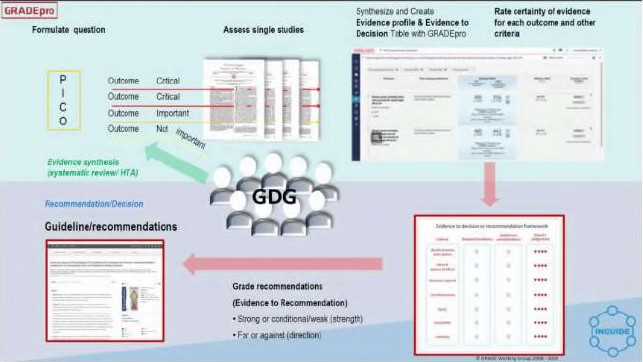 (元のファイル名: image35.jpg)
-  (元のファイル名: image36.jpg)
-  (元のファイル名: image37.jpg)
-  (元のファイル名: image38.jpg)
-  (元のファイル名: image39.jpg)
-  (元のファイル名: image40.jpg)
-  (元のファイル名: image41.jpg)
-  (元のファイル名: image42.jpg)
- 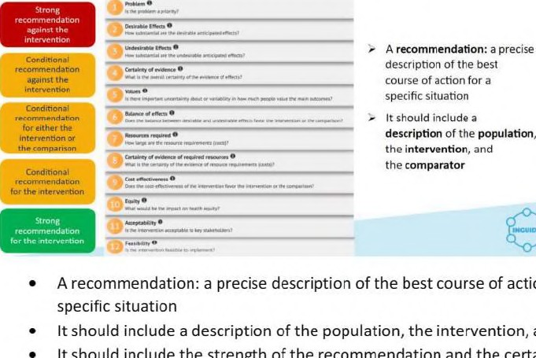 (元のファイル名: image43.jpg)
-  (元のファイル名: image44.jpg)
-  (元のファイル名: image45.jpg)
-  (元のファイル名: image46.jpg)
-  (元のファイル名: image47.jpg)
-  (元のファイル名: image48.jpg)
- 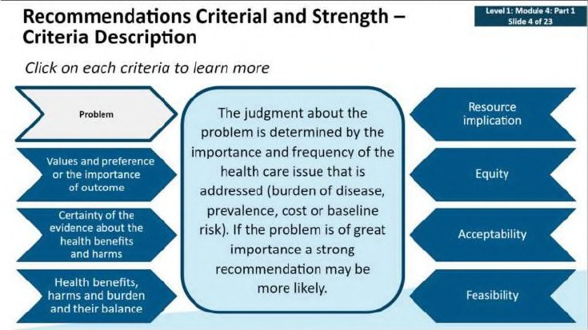 (元のファイル名: image49.jpg)
-  (元のファイル名: image50.jpg)
-  (元のファイル名: image51.jpg)
-  (元のファイル名: image52.jpg)
-  (元のファイル名: image53.jpg)
-  (元のファイル名: image54.jpg)
-  (元のファイル名: image55.jpg)
-  (元のファイル名: image56.jpg)
-  (元のファイル名: image57.jpg)
-  (元のファイル名: image58.jpg)
-  (元のファイル名: image59.jpg)
-  (元のファイル名: image60.jpg)
-  (元のファイル名: image61.jpg)
-  (元のファイル名: image62.jpg)
-  (元のファイル名: image63.jpg)
-  (元のファイル名: image64.jpg)
-  (元のファイル名: image65.jpg)
- 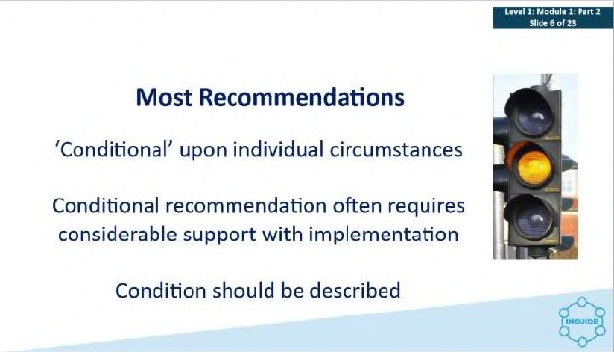 (元のファイル名: image66.jpg)
- 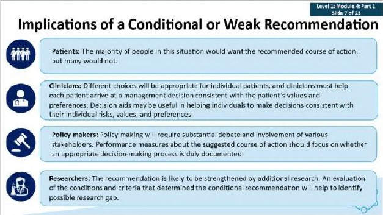 (元のファイル名: image67.jpg)
-  (元のファイル名: image68.jpg)
-  (元のファイル名: image69.jpg)
-  (元のファイル名: image70.jpg)
-  (元のファイル名: image71.jpg)
-  (元のファイル名: image72.jpg)
-  (元のファイル名: image73.jpg)
- 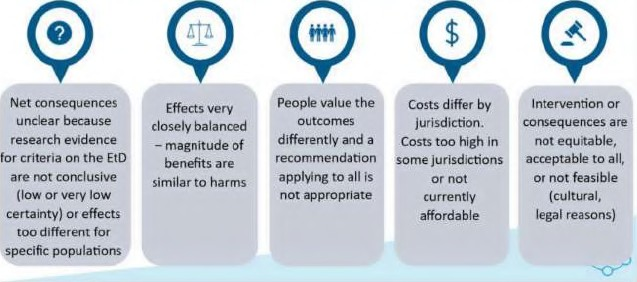 (元のファイル名: image74.jpg)
-  (元のファイル名: image75.jpg)
-  (元のファイル名: image76.jpg)
-  (元のファイル名: image77.jpg)
-  (元のファイル名: image78.jpg)
-  (元のファイル名: image79.jpg)
-  (元のファイル名: image80.jpg)
-  (元のファイル名: image81.jpg)
-  (元のファイル名: image82.jpg)
-  (元のファイル名: image83.jpg)
-  (元のファイル名: image84.jpg)
-  (元のファイル名: image85.jpg)
-  (元のファイル名: image86.jpg)
-  (元のファイル名: image87.jpg)
-  (元のファイル名: image88.jpg)
-  (元のファイル名: image89.jpg)
-  (元のファイル名: image90.jpg)
-  (元のファイル名: image91.jpg)
-  (元のファイル名: image92.jpg)
-  (元のファイル名: image93.jpg)
- 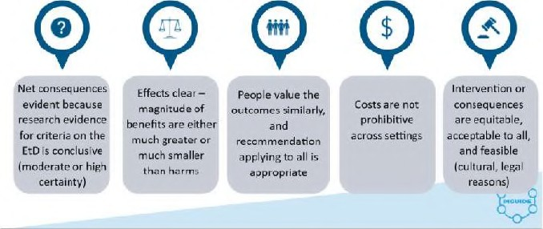 (元のファイル名: image94.jpg)
-  (元のファイル名: image95.jpg)
-  (元のファイル名: image96.jpg)
- 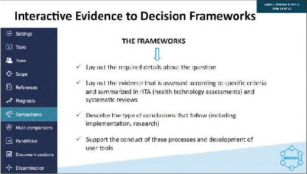 (元のファイル名: image97.jpg)
-  (元のファイル名: image98.jpg)
-  (元のファイル名: image99.jpg)
-  (元のファイル名: image100.jpg)
-  (元のファイル名: image101.jpg)
-  (元のファイル名: image102.jpg)
-  (元のファイル名: image103.jpg)
-  (元のファイル名: image104.jpg)
-  (元のファイル名: image105.jpg)
-  (元のファイル名: image106.jpg)
-  (元のファイル名: image107.jpg)
-  (元のファイル名: image108.jpg)
-  (元のファイル名: image109.jpg)
-  (元のファイル名: image110.jpg)
-  (元のファイル名: image111.jpg)
-  (元のファイル名: image112.jpg)
- 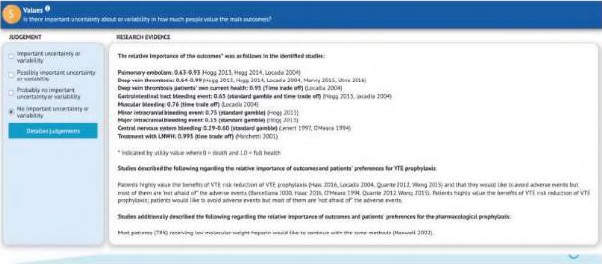 (元のファイル名: image113.jpg)
-  (元のファイル名: image114.jpg)
-  (元のファイル名: image115.jpg)
- 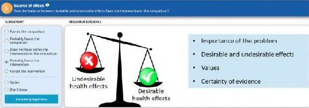 (元のファイル名: image116.jpg)
-  (元のファイル名: image117.jpg)
-  (元のファイル名: image118.jpg)
-  (元のファイル名: image119.jpg)
-  (元のファイル名: image120.jpg)
-  (元のファイル名: image121.jpg)
-  (元のファイル名: image122.jpg)
- 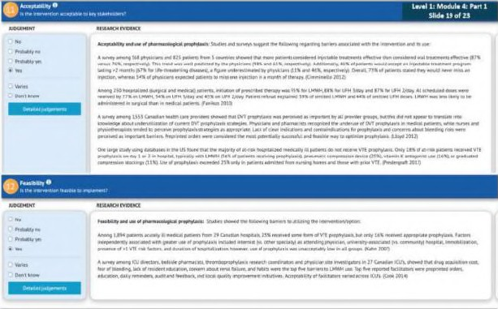 (元のファイル名: image123.jpg)
-  (元のファイル名: image124.jpg)
-  (元のファイル名: image125.jpg)
-  (元のファイル名: image126.jpg)
- 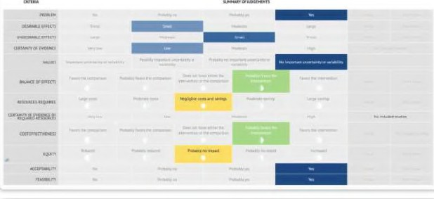 (元のファイル名: image127.jpg)
- 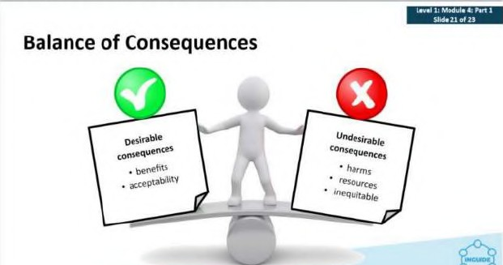 (元のファイル名: image128.jpg)
-  (元のファイル名: image129.jpg)
-  (元のファイル名: image130.jpg)
- 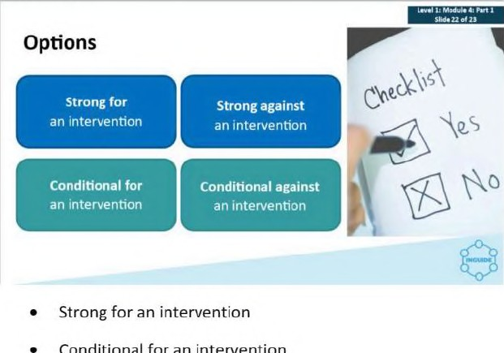 (元のファイル名: image131.jpg)
-  (元のファイル名: image132.jpg)
-  (元のファイル名: image133.jpg)
-  (元のファイル名: image134.jpg)
-  (元のファイル名: image135.jpg)
-  (元のファイル名: image136.jpg)
-  (元のファイル名: image137.jpg)
-  (元のファイル名: image138.jpg)
-  (元のファイル名: image139.jpg)
-  (元のファイル名: image140.jpg)
-  (元のファイル名: image141.jpg)
-  (元のファイル名: image142.jpg)
-  (元のファイル名: image143.jpg)
-  (元のファイル名: image144.jpg)
-  (元のファイル名: image145.jpg)
-  (元のファイル名: image146.jpg)
-  (元のファイル名: image147.jpg)
-  (元のファイル名: image148.jpg)
-  (元のファイル名: image149.jpg)
-  (元のファイル名: image150.jpg)
-  (元のファイル名: image151.jpg)
-  (元のファイル名: image152.jpg)
-  (元のファイル名: image153.jpg)
-  (元のファイル名: image154.jpg)
-  (元のファイル名: image155.jpg)
-  (元のファイル名: image156.jpg)
-  (元のファイル名: image157.jpg)
-  (元のファイル名: image158.jpg)
-  (元のファイル名: image159.jpg)
-  (元のファイル名: image160.jpg)
-  (元のファイル名: image161.jpg)
-  (元のファイル名: image162.jpg)
-  (元のファイル名: image163.jpg)
-  (元のファイル名: image164.jpg)
-  (元のファイル名: image165.jpg)
-  (元のファイル名: image166.jpg)
-  (元のファイル名: image167.jpg)
-  (元のファイル名: image168.jpg)
-  (元のファイル名: image169.jpg)
-  (元のファイル名: image170.jpg)
-  (元のファイル名: image171.jpg)
-  (元のファイル名: image172.jpg)
-  (元のファイル名: image173.jpg)
-  (元のファイル名: image174.jpg)
-  (元のファイル名: image175.jpg)
-  (元のファイル名: image176.jpg)
-  (元のファイル名: image177.jpg)
-  (元のファイル名: image178.jpg)
-  (元のファイル名: image179.jpg)
-  (元のファイル名: image180.jpg)
-  (元のファイル名: image181.jpg)
- 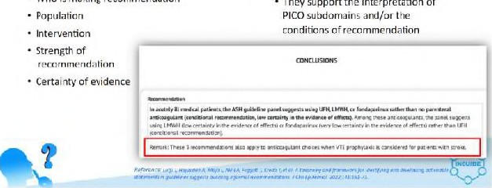 (元のファイル名: image182.jpg)
-  (元のファイル名: image183.jpg)
-  (元のファイル名: image184.jpg)
-  (元のファイル名: image185.jpg)
- 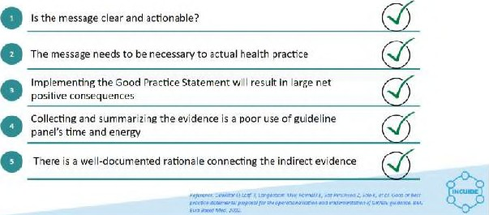 (元のファイル名: image186.jpg)
-  (元のファイル名: image187.jpg)
-  (元のファイル名: image188.jpg)
-  (元のファイル名: image189.jpg)
-  (元のファイル名: image190.jpg)
-  (元のファイル名: image191.jpg)
-  (元のファイル名: image193.jpg)
-  (元のファイル名: image194.jpg)
-  (元のファイル名: image195.jpg)
-  (元のファイル名: image196.jpg)
-  (元のファイル名: image197.jpg)
-  (元のファイル名: image198.jpg)
-  (元のファイル名: image199.jpg)
-  (元のファイル名: image200.jpg)
-  (元のファイル名: image201.jpg)
-  (元のファイル名: image202.jpg)
-  (元のファイル名: image203.jpg)
-  (元のファイル名: image204.jpg)
- 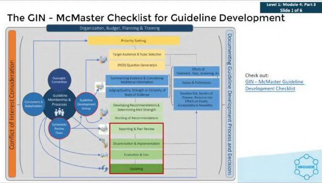 (元のファイル名: image205.jpg)
-  (元のファイル名: image206.jpg)
- 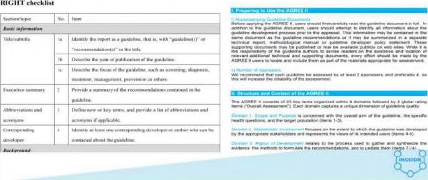 (元のファイル名: image207.jpg)
-  (元のファイル名: image208.jpg)
-  (元のファイル名: image209.jpg)
-  (元のファイル名: image210.jpg)
-  (元のファイル名: image211.jpg)
-  (元のファイル名: image212.jpg)
-  (元のファイル名: image213.jpg)
-  (元のファイル名: image214.jpg)
-  (元のファイル名: image215.jpg)
-  (元のファイル名: image216.jpg)
-  (元のファイル名: image217.jpg)
-  (元のファイル名: image218.jpg)
-  (元のファイル名: image219.jpg)
-  (元のファイル名: image220.jpg)
-  (元のファイル名: image221.jpg)
-  (元のファイル名: image222.jpg)
-  (元のファイル名: image223.jpg)
-  (元のファイル名: image224.jpg)
-  (元のファイル名: image225.jpg)
-  (元のファイル名: image192.jpg)
-  (元のファイル名: image227.jpg)
-  (元のファイル名: image228.jpg)
-  (元のファイル名: image229.jpg)
-  (元のファイル名: image230.jpg)
-  (元のファイル名: image231.jpg)
-  (元のファイル名: image232.jpg)
-  (元のファイル名: image233.jpg)
-  (元のファイル名: image234.jpg)
-  (元のファイル名: image235.jpg)
-  (元のファイル名: image1.jpeg)
-  (元のファイル名: image2.jpeg)
-  (元のファイル名: image3.jpeg)
-  (元のファイル名: image4.jpeg)
-  (元のファイル名: image5.jpg)
-  (元のファイル名: image226.jpg)
-  (元のファイル名: image985.jpg)
-  (元のファイル名: image988.jpg)
-  (元のファイル名: image545.jpg)
-  (元のファイル名: image1002.jpg)
- 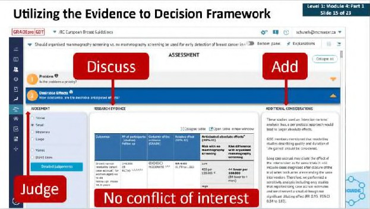 (元のファイル名: image685.jpg)
-  (元のファイル名: image1015.jpg)
-  (元のファイル名: image1017.jpg)
-  (元のファイル名: image1021.jpg)
-  (元のファイル名: image827.jpg)
-  (元のファイル名: image1044.jpg)
-  (元のファイル名: image924.jpg)
